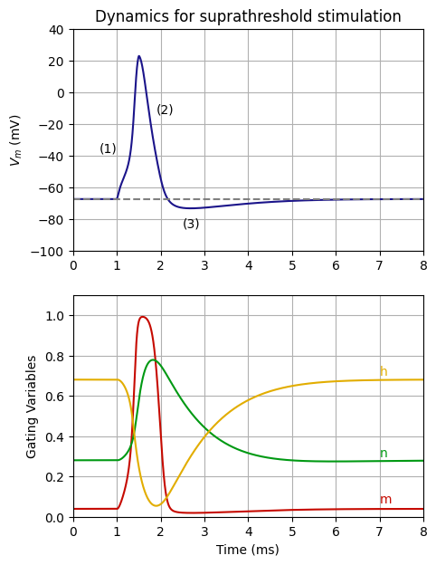
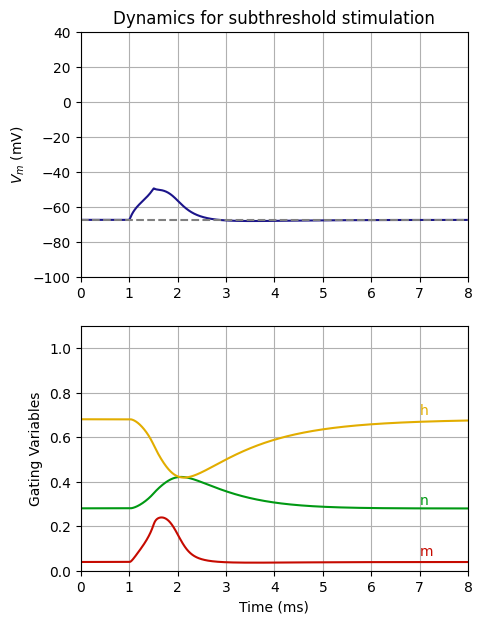

Conductance model dynamic with stimulation
==========================================

This code highlith how to retrieve particle dynamics in results.

.. code:: ipython3

    import nrv
    import matplotlib.pyplot as plt
    
    # nrvon def
    y = 0									# nrvon y position, in [um]
    z = 0									# nrvon z position, in [um]
    d = 1									# nrvon diameter, in [um]
    
    plot_node = 50
    
    dt = 0.005
    t_sim = 8
    
    # first test pulse
    L = 5000
    t_start = 1
    duration = 0.5
    amplitude = 0.35
    
    axon1 = nrv.unmyelinated(y,z,d,L,T = 21,model='HH',dt=0.001,Nrec=100)
    axon1.insert_I_Clamp(0.5, t_start, duration, amplitude)
    results = axon1.simulate(t_sim=t_sim,record_I_ions=True, record_particles=True)
    
    del axon1
    
    color_1 = "#1B148A"
    color_2 = "#C60A00"
    color_3 = "#009913"
    color_4 = "#E2AD00"
    
    V_rest= results['V_mem'][plot_node][0]
    
    fig, axs = plt.subplots(2)
    fig.set_size_inches(5, 7)
    axs[0].plot(results['t'],results['V_mem'][plot_node],color = color_1,alpha = 1)
    axs[0].axhline(y = V_rest, color = 'gray', linestyle = '--')
    #axs[0].set_xlabel('time (ms)')
    axs[0].set_ylabel('$V_m$ (mV)')
    axs[0].set_xlim(0,t_sim)
    axs[0].set_ylim(-100,40)
    axs[0].grid(True)
    axs[0].text(0.6,-38.0,'(1)')
    axs[0].text(1.9,-13.0,'(2)')
    axs[0].text(2.5,-85.0,'(3)')
    
    
    axs[1].plot(results['t'],results['m'][plot_node],label='m',color = color_2,alpha = 1)
    axs[1].plot(results['t'],results['n'][plot_node],label='n',color = color_3)
    axs[1].plot(results['t'],results['h'][plot_node],label='h',color = color_4)
    axs[1].set_xlabel('Time (ms)')
    axs[1].set_ylabel('Gating Variables')
    axs[1].set_xlim(0,t_sim)
    axs[1].set_ylim(0,1.1)
    axs[1].grid(True)
    axs[1].text(7,0.70,'h',color = color_4)
    axs[1].text(7,0.30,'n',color = color_3)
    axs[1].text(7,0.07,'m',color = color_2)
    axs[0].set_title('Dynamics for suprathreshold stimulation')
    
    
    amplitude = 0.195
    axon1 = nrv.unmyelinated(y,z,d,L,model='HH',dt=0.001,Nrec=100,T=21)
    axon1.insert_I_Clamp(0.5, t_start, duration, amplitude)
    results = axon1.simulate(t_sim=t_sim,record_I_ions=True, record_particles=True)
    
    del axon1
    
    V_rest= results['V_mem'][plot_node][0]
    fig, axs = plt.subplots(2)
    fig.set_size_inches(5, 7)
    axs[0].plot(results['t'],results['V_mem'][plot_node],color = color_1,alpha = 1)
    axs[0].axhline(y = V_rest, color = 'gray', linestyle = '--')
    #axs[0].set_xlabel('time (ms)')
    axs[0].set_ylabel('$V_m$ (mV)')
    axs[0].set_xlim(0,t_sim)
    axs[0].set_ylim(-100,40)
    axs[0].grid(True)
    
    
    axs[1].plot(results['t'],results['m'][plot_node],label='m',color = color_2,alpha = 1)
    axs[1].plot(results['t'],results['n'][plot_node],label='n',color = color_3)
    axs[1].plot(results['t'],results['h'][plot_node],label='h',color = color_4)
    axs[1].set_xlabel('Time (ms)')
    axs[1].set_ylabel('Gating Variables')
    axs[1].set_xlim(0,t_sim)
    axs[1].set_ylim(0,1.1)
    axs[1].grid(True)
    axs[1].text(7,0.70,'h',color = color_4)
    axs[1].text(7,0.30,'n',color = color_3)
    axs[1].text(7,0.07,'m',color = color_2)
    axs[0].set_title('Dynamics for subthreshold stimulation')

.. parsed-literal::

    Text(0.5, 1.0, 'Dynamics for subthreshold stimulation')

