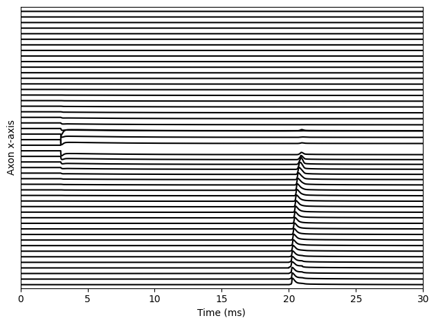

Example 7: DC Propagation block
===============================

This example provides an example of action potential propagation block
using a DC stimulation. This is perfectly working in silico, but can be
unsafe in vivo as long DC values are unbalanced and can damage tissues
surrounding the electrode

.. code:: ipython3

    import nrv
    import numpy as np
    import matplotlib.pyplot as plt
    
    
    model = 'MRG'
    diam = 10
    y = 0
    z = 0
    n_node = 50
    
    
    t_sim = 50
    t_position=0.05
    t_start=20
    t_duration=1
    t_amplitude=1
    
    b_start = 3
    b_duration = t_sim
    block_amp = 100
    nseg = 3
    material = nrv.load_material('endoneurium_bhadra')
    
    
    L=nrv.get_length_from_nodes(diam,n_node)
    
    axon = nrv.myelinated(y,z,diam,L,rec='nodes',dt=0.005,Nseg_per_sec=nseg,model=model) 
    
    y_elec = 100
    z_elec = 0
    x_elec = axon.x_nodes[np.int32(n_node/2)]	# electrode y position, in [um]
    E1 = nrv.point_source_electrode(x_elec,y_elec,z_elec)
    
    # insert test spike
    axon.insert_I_Clamp(t_position, t_start, t_duration, t_amplitude)
    # extra-cellular stimulation
    stim_1 = nrv.stimulus()
    stim_1.biphasic_pulse(b_start, block_amp, b_duration, 0, 0,anod_first=False)
    
    stim_extra = nrv.stimulation(material)
    stim_extra.add_electrode(E1,stim_1)
    axon.attach_extracellular_stimulation(stim_extra)
    
    # simulate axon activity
    results = axon.simulate(t_sim=t_sim)#,footprints = footprints)
    
    
    plt.figure()
    for k in range(len(results['x_rec'])):
    	plt.plot(results['t'],results['V_mem'][k]+100*k,color='k')
    plt.yticks([])
    plt.ylabel("Axon x-axis")
    plt.xlabel("Time (ms)")
    
    plt.xlim(0,30)
    plt.ylim(-143,4900)
    plt.tight_layout()
    plt.show()

