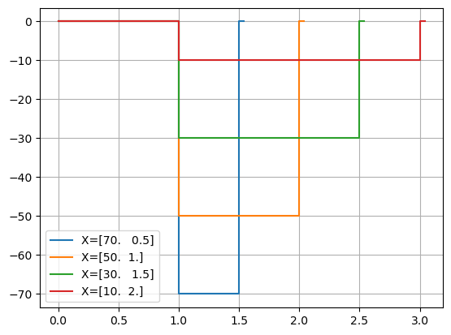
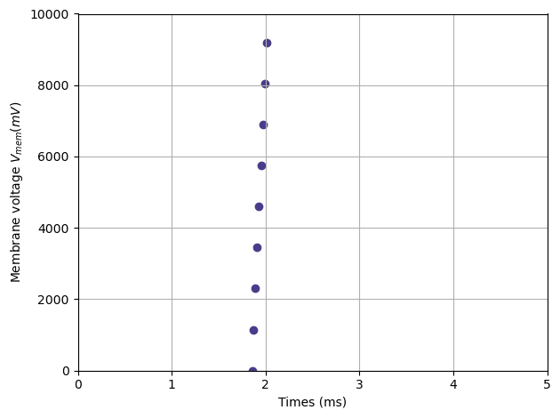

First optimization problem using NRV
====================================

--------------

In this tutorial, the optimization formalism used in NRV is illustrated
through a detailed example. Further details on NRV optimization
formalism can be found in
:doc:``usersguide's optimization section</usersguide/optimization>``.

To reduce the computation time, this optimization will be done on a
single myelinated axon. The exact same optimization problem could be
applied to a nerve filled with multiple myelinated axons (see example
(XXX))

The very first step is, as usual, to import NRV and the required
packages and to generate an outputs’ repository.

.. code:: ipython3

    import matplotlib.pyplot as plt
    import numpy as np
    import os
    import sys
    sys.path.append("../")
    import nrv
    
    np.random.seed(444)
    
    test_name = "Tutorial_5"
    dir_res = f"./{test_name}/"
    if not os.path.isdir(dir_res):
        os.mkdir(dir_res)

First optimization: Pulse Stimulus on Single axon
-------------------------------------------------

The objective of the first optimization problem is to **minimize a
rectangle pulse stimulus energy required by a LIFE-electrode to trigger
a single myelinated fibre**.

Cost function
~~~~~~~~~~~~~

To begin, we can create an empty cost function object and fill it
progressively with its components.

.. code:: ipython3

    ## Cost function definition
    my_cost0 = nrv.cost_function()

.. code:: ipython3

    axon_file = dir_res + "myelinated_axon.json"
    
    ax_l = 10000 # um
    ax_d=10
    ax_y=50
    ax_z=0
    axon_1 = nrv.myelinated(L=ax_l, d=ax_d, y=ax_y, z=ax_z)
    
    
    LIFE_stim0 = nrv.FEM_stimulation()
    LIFE_stim0.reshape_nerve(Length=ax_l)
    life_d = 25 # um
    life_length = 1000 # um
    life_x_0_offset = life_length/2
    life_y_c_0 = 0
    life_z_c_0 = 0
    elec_0 = nrv.LIFE_electrode("LIFE", life_d, life_length, life_x_0_offset, life_y_c_0, life_z_c_0)
    
    dummy_stim = nrv.stimulus()
    dummy_stim.pulse(0, 0.1, 1)
    LIFE_stim0.add_electrode(elec_0, dummy_stim)
    
    axon_1.attach_extracellular_stimulation(LIFE_stim0)
    axon_1.get_electrodes_footprints_on_axon()
    _ = axon_1.save(save=True, fname=axon_file, extracel_context=True)
    
    fig, ax = plt.subplots(1, 1, figsize=(6,6))
    axon_1.plot(ax)
    ax.set_xlim((-1.2*ax_y, 1.2*ax_y))
    ax.set_ylim((-1.2*ax_y, 1.2*ax_y))
    
    del axon_1

.. parsed-literal::

    NRV INFO: Mesh properties:
    NRV INFO: Number of processes : 3
    NRV INFO: Number of entities : 36
    NRV INFO: Number of nodes : 11333
    NRV INFO: Number of elements : 80591
    NRV INFO: Static/Quasi-Static electrical current problem
    NRV INFO: FEN4NRV: setup the bilinear form
    NRV INFO: FEN4NRV: setup the linear form
    NRV INFO: Static/Quasi-Static electrical current problem
    NRV INFO: FEN4NRV: solving electrical potential
    NRV INFO: FEN4NRV: solved in 4.154873847961426 s

.. image:: 5_first_optimization_files/5_first_optimization_5_1.png

Once this static context has been saved in the cost function it should
be linked with the ``cost_function``.

For that purpose, we can use the method ``set_static_context`` as
bellow.

Note that additional keys arguments can be added to precise simulation
parameter. Here we impose a simulation time of :math:`5ms` and a time
step of :math:`5\mu s`. These arguments will be added when the
``simulate`` method will be called so all the parameters of a standard
simulation can be as in previous example

.. code:: ipython3

    static_context = axon_file
    t_sim = 5
    dt = 0.005
    kwarg_sim = {
        "dt":dt,
        "t_sim":t_sim,
    }
    
    my_cost0.set_static_context(axon_file, **kwarg_sim)

.. code:: ipython3

    t_start = 1
    I_max_abs = 100
    
    cm_0 = nrv.biphasic_stimulus_CM(start=t_start, s_cathod="0", t_cathod="1", s_anod=0)
    my_cost0.set_context_modifier(cm_0)

The following lines illustrate the stimuli generated by the ``cm_0`` for
various input parameters.

As expected: - The first dimension sets the pulse’s negative amplitude.
- The second sets the pulse duration.

.. code:: ipython3

    test_points = np.array([[70, 0.5], [50, 1], [30, 1.5], [10, 2]])
    
    fig, ax = plt.subplots()
    ax.grid()
    for X in test_points:
        axon_x = cm_0(X, static_context)
        stim = axon_x.extra_stim.stimuli[0]
        stim.plot(ax, label=f"X={X}")
        ax.legend()
        del axon_x

.. code:: ipython3

    costR = nrv.recrutement_count_CE(reverse=True)
    costC = nrv.stim_energy_CE()
    
    cost_evaluation = costR + 0.01 * costC
    my_cost0.set_cost_evaluation(cost_evaluation)

Optimization problem
--------------------

At this point, the cost function that should be minimized is fully
defined. We can now proceed to define the entire optimization process by
selecting the appropriate optimizer.

The cost function defined for this problem is not continuous due to the
second term of the cost evaluation equation
(:math:`\alpha_r(N_{axon} - N_{recruited})`). Therefore, a
meta-heuristic approach is more suitable for our needs.

We can thus instantiate a :class:``~nrv.optim.Optimizers.PSO_optimizer``
object adapted to our problem as bellow. The parameters relative to the
optimization are added at the instantiation. Here:

-  ``maxiter``: sets the number of iterations of the optimization.
-  ``n_particles``: set the number of particle of the swarm.
-  ``opt_type``: sets the neighbour topology as star (when “global”) or
   ring (when “local”).
-  ``options``: sets the ``Pyswarms``\ ’s PSO option.
-  ``bh_strategy``: sets the out-of-bounds handling strategy.

See `Pyswarms <https://pyswarms.readthedocs.io/en/latest/>`__
documentation for more information

.. code:: ipython3

    pso_kwargs = {
        "maxiter" : 50,
        "n_particles" : 20,
        "opt_type" : "local",
        "options": {'c1': 0.6, 'c2': 0.6, 'w': 0.8, 'k': 3, 'p': 1},
        "bh_strategy": "reflective",
    }
    pso_opt = nrv.PSO_optimizer(**pso_kwargs)

Once both the ``cost_function`` and the ``optimizer`` are defined the
optimization problem can be simply as bellow

.. code:: ipython3

    # Problem definition
    my_prob = nrv.Problem()
    my_prob.costfunction = my_cost0
    my_prob.optimizer = pso_opt

.. code:: ipython3

    
    t_end = 0.5
    duration_bound = (0.01, t_end)
    bounds0 = (
        (0, I_max_abs),
        duration_bound
    )
    pso_kwargs_pb_0 = {
        "dimensions" : 2,
        "bounds" : bounds0,
        "comment":"pulse"}
    
    res0 = my_prob(**pso_kwargs_pb_0)

.. parsed-literal::

    pyswarms.single.general_optimizer: 100%|██████████|50/50, best_cost=0.0294

Hurray! The first optimization is now complete.

We can check the best input vector and the best final cost stored in
``res0["x"]`` and ``res0["best_cost"]`` respectively.

.. code:: ipython3

    print("best input vector:", res0["x"], "\nbest cost:", res0["best_cost"])

.. parsed-literal::

    best input vector: [3.9857663821182845, 0.18529750144398588] 
    best cost: 0.02943955063084398

We can explore further the results of the optimization by plotting the
best stimulus shape and the cost history.

.. code:: ipython3

    fig_costs, axs_costs = plt.subplots(2, 1)
    
    stim = cm_0(res0.x, static_context).extra_stim.stimuli[0]
    stim.plot(axs_costs[0], label="rectangle pulse")
    axs_costs[0].set_xlabel("best stimulus shape")
    axs_costs[0].set_xlabel("time (ms)")
    axs_costs[0].set_ylabel("amplitude (µA)")
    axs_costs[0].grid()
    
    res0.plot_cost_history(axs_costs[1])
    axs_costs[1].set_xlabel("optimization iteration")
    axs_costs[1].set_ylabel("cost")
    axs_costs[1].grid()
    fig_costs.tight_layout()

.. image:: 5_first_optimization_files/5_first_optimization_23_0.png

Using the method ``compute_best_pos``, the axon with the optimized
stimulus can be simulated.

This can be useful to make sure the axon is activated by plotting the
rasterized :math:`V_{mem}` as in tuto 1 (XXX).

.. code:: ipython3

    simres = res0.compute_best_pos(my_cost0)
    simres.rasterize("V_mem")
    plt.figure()
    plt.scatter(simres["V_mem_raster_time"], simres["V_mem_raster_x_position"], color='darkslateblue')
    plt.xlabel('Times (ms)')
    plt.ylabel('Membrane voltage $V_{mem} (mV)$')
    plt.xlim(0, t_sim)
    plt.ylim(0, simres["L"])
    plt.grid()
    plt.tight_layout()

Second optimization spline interpolated stimulus
------------------------------------------------

At this point, we have found a rectangle pulse stimulus shape triggering
our fibre with a minimal energy. Let’s see if we can find a better cost
with a more complex stimulus shape.

In this new problem, we can define the stimulus as a cathodic pulse
through interpolated splines over :math:`2` points which are
individually defined in time and amplitude. This second optimization
scenario results in a :math:`4`-dimensional problem with the input
vector :math:`\mathcal{X}_{s_2}` defined as:

.. math::

   \mathcal{X}_{s_2} = \begin{pmatrix} I_{s_1} & t_{s_1} & I_{s_2} & t_{s_2}    \end{pmatrix}

With :math:`I_{s_1}` and :math:`t_{s_1}` the amplitude and time of the
first point and :math:`I_{s_2}` and :math:`t_{s_2}` those of the second.

As in the first optimization, the stimulus generation from input vector
is handled by the ``context_modifier``. So let’s define a new one which
will fit our purpose. This can be done using another built-in class in
NRV: :class:``~nrv.optim.optim_utils.ContextModifiers.stimulus_CM``. To
fit with our problem the following parameters are set

.. code:: ipython3

    kwrgs_interp = {
        "dt": dt,
        "amp_start": 0,
        "amp_stop": 0,
        "intertype": "Spline",
        "bounds": (-I_max_abs, 0),
        "t_sim":t_sim,
        "t_end": t_end,
        "t_shift": t_start,
        }
    cm_1 = nrv.stimulus_CM(interpolator=nrv.interpolate_Npts, intrep_kwargs=kwrgs_interp, t_sim=t_sim)

As before, we can plot several stimulus shapes generated from this new
``context_modifier``

.. code:: ipython3

    test_points = np.array([[.1, -10, .2, -20], [.1, -60, .3, -45]])
    
    fig, ax = plt.subplots()
    ax.grid()
    for X in test_points:
        axon_x = cm_1(X, static_context)
        stim = axon_x.extra_stim.stimuli[0]
        stim.plot(ax, label=f"X={X}")
        plt.scatter(t_start+X[::2], X[1::2])
        ax.legend()
        del axon_x

.. image:: 5_first_optimization_files/5_first_optimization_29_0.png

This time all the components of the new ``cost_function`` are already
defined. It can thus be directly defined at the instantiation of the
``cost_function`` as bellow.

.. code:: ipython3

    my_cost_1 = nrv.cost_function(
        static_context=static_context,
        context_modifier=cm_1,
        cost_evaluation=cost_evaluation,
        kwargs_S=kwarg_sim)

We can now update our optimization problem with this second
``cost_function``.

Since the number of dimensions and the bounds of each dimension are
different from the first problem, the optimizer parameters must also be
updated. This can be done when running the optimization.

.. code:: ipython3

    my_prob.costfunction = my_cost_1
    
    I_bound = (-I_max_abs, 0)
    t_bound = (0, t_end)
    bounds1 = (t_bound, I_bound, t_bound, I_bound)
    pso_kwargs_pb_1 = {
        "dimensions" : 4,
        "bounds" : bounds1,
        "comment":"spline",
    }
    
    res1 = my_prob(**pso_kwargs_pb_1)

.. parsed-literal::

    pyswarms.single.general_optimizer: 100%|██████████|50/50, best_cost=0.0279

Finally, we can update the figure of the first results with this new
optimized stimulus and the cost history to compare the results.

.. code:: ipython3

    stim = cm_1(res1.x, static_context).extra_stim.stimuli[0]
    stim.plot(axs_costs[0], label="spline interpolated pulse")
    axs_costs[0].legend()
    res1.plot_cost_history(axs_costs[1])
    fig_costs

.. image:: 5_first_optimization_files/5_first_optimization_35_0.png

