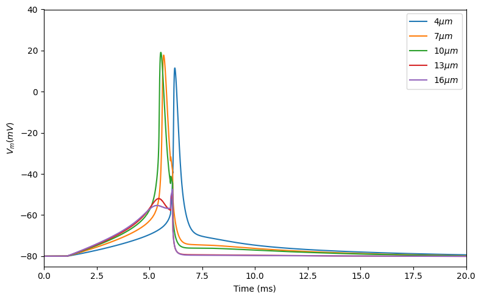

===========================================
Example 10: slowly rising pulse stimulation
===========================================

A slowly rising pulse can help in triggering small diameter axon first.
This scripts is an example of

.. code:: ipython3

    import nrv
    import numpy as np
    import matplotlib.pyplot as plt
    
    model = 'MRG'
    diams = [4, 7,  10, 13, 16]
    Vm = []
    y = 0
    z = 0
    n_node = 20
    
    t_sim = 20
    t_start = 1
    prep_d = 5
    prep_a = 35
    interp_delay = 0
    pw = 100e-3
    amp = 48
    
    prepulse = nrv.stimulus()
    
    slope = prep_a/prep_d
    prepulse.ramp(slope, t_start, prep_d+t_start, 0.05)
    pulse = nrv.stimulus()
    pulse.biphasic_pulse(t_start+prep_d,amp,pw,0,0)
    stim_1 = -prepulse+pulse
    stim_1.s[-2] = -amp
    stim_1.s[-1] = 0
    
    nseg = 1
    material = nrv.load_material('endoneurium_bhadra')
    
    
    for diam in diams:
        L=nrv.get_length_from_nodes(diam,n_node)
        axon = nrv.myelinated(y,z,diam,L,rec='nodes',dt=0.005,Nseg_per_sec=nseg,model=model) 
    
        y_elec = 500
        z_elec = 0
        x_elec = axon.x_nodes[np.int32(n_node/2)]	# electrode y position, in [um]
        E1 = nrv.point_source_electrode(x_elec,y_elec,z_elec)
    
        
    
        #stim_1 = pulse
        stim_extra = nrv.stimulation(material)
        stim_extra.add_electrode(E1,stim_1)
        axon.attach_extracellular_stimulation(stim_extra)
    
        #axon1.insert_I_Clamp(t_position, t_start, t_duration, t_amplitude)       
    
        # extra-cellular stimulation
    
        # simulate axon activity
        results = axon.simulate(t_sim=t_sim)#,footprints = footprints)
        Vm.append(results['V_mem'][10])
    
    
    plt.figure(figsize=(8,5))
    for i in range(len(diams)):
        plt.plot(results['t'],Vm[i], label="$"+str(diams[i])+"\mu m$")
    plt.ylabel("$V_m (mV)$")
    plt.xlabel("Time (ms)")
    plt.legend()
    
    plt.xlim(np.min(results['t']),np.max(results['t']))
    plt.ylim(-85,40)
    plt.tight_layout()
    plt.show()

