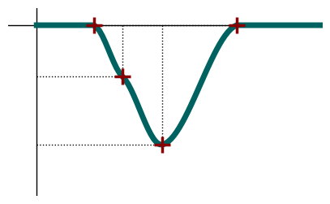
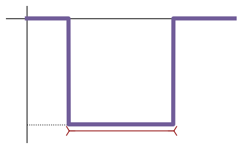

Example O-01: Ploting Optimization - context modifiers
======================================================

This is a very small example of a way to plot the built-in
``context_modifiers``

.. code:: ipython3

    import numpy as np
    import sys
    import matplotlib.pyplot as plt
    
    sys.path.append("../")
    import nrv
    
    fname = "figures/stimuli_v2"
    small_linewidth = 1
    big_linewidth = 5
    markersize = 15
    
    
    dt = 0.005
    t_sim = 0.5
    t_end = 0.5
    I_max_abs = 100
    t_bound = (0, t_end)
    I_bound = (-I_max_abs, 0)
    
    ###################################################################
    ####################### waveform figure ###################
    ##################################################################
    # Biphasic pulse
    t_start = 0.1
    context_modifier1 = nrv.biphasic_stimulus_CM(start=t_start, I_cathod="0", T_cathod="1", I_anod=0)
    def generate_waveform0(Xsp2, t_sim=100, **kwargs):
        stim = context_modifier1.stimulus_generator(Xsp2)
        stim0 = nrv.stimulus()
        stim0.s = np.zeros(1000)
        stim0.t = np.linspace(0, t_sim, 1000)
        stim0 += stim
        return stim0.s
    
    Xb = [85, 0.25]
    
    waveform0 = generate_waveform0(Xb, t_sim=t_sim)
    t0 = np.linspace(0, t_sim, len(waveform0))
    # Spline 2pts
    kwrgs_interp = {
        "dt": dt,
        "amp_start": 0,
        "amp_stop": 0,
        "intertype": "Spline",
        "bounds": I_bound,
        "fixed_order": False,
        "t_end": t_end,
        "t_sim":t_sim,
        "t_shift":0,
        "strict_bounds":True,
        }
    
    
    Xsp1 = [0.1, 0]
    Xsp1 += [0.27, -20]
    Xsp1 += [0.35,0]
    
    waveform1 = nrv.interpolate_Npts(Xsp1,**kwrgs_interp)
    t1 = np.linspace(0, t_sim, len(waveform1))
    
    Xsp2 = [0.1, 0]
    Xsp2 += [0.22, -70]
    Xsp2 += [0.15, -30]
    Xsp2 += [0.35,0]
    
    waveform2 = nrv.interpolate_Npts(Xsp2,**kwrgs_interp)
    t2 = np.linspace(0, t_sim, len(waveform2))
    
    
    fig, ax = plt.subplots(figsize=(5,3))
    #plt.gcf()
    
    #axes
    ax.set_axis_off()
    t_bound_plot = [-0.05, t_sim]
    I_bound_plot = [-I_max_abs, 10]
    
    ax.set_xlim(t_bound_plot)
    ax.set_ylim(I_bound_plot)
    ax.set_xticks([])
    ax.set_yticks([])
    ax.plot(t_bound_plot, [0, 0], linewidth=small_linewidth,color="k")
    ax.plot([0, 0], I_bound_plot, linewidth=small_linewidth,color="k")

.. parsed-literal::

    [<matplotlib.lines.Line2D at 0x30401bd70>]

.. image:: ../images/o01_plot_optim_1_1.png

waveform 2
----------

.. code:: ipython3

    # details wf2
    for i in range(len(Xsp2)//2):
        ax.plot([Xsp2[2*i], Xsp2[2*i]], [0, Xsp2[2*i+1]], ":", linewidth=small_linewidth,color="k")
        ax.plot([0, Xsp2[2*i]], [Xsp2[2*i+1], Xsp2[2*i+1]], ":", linewidth=small_linewidth,color="k")
    
    
    # wf2
    ax.plot(t2, waveform2, linewidth=big_linewidth,color="#006161")
    ax.plot(Xsp2[::2], Xsp2[1::2], "+", markersize=markersize, markeredgewidth=big_linewidth/2,color="darkred")
    fig

waveform 1
----------

.. code:: ipython3

    # details wf1
    for i in range(len(Xsp1)//2):
        ax.plot([Xsp1[2*i], Xsp1[2*i]], [0, Xsp1[2*i+1]], ":", linewidth=small_linewidth,color="k")
        ax.plot([0, Xsp1[2*i]], [Xsp1[2*i+1], Xsp1[2*i+1]], ":", linewidth=small_linewidth,color="k")
    
    
    # wf2
    ax.plot(t1, waveform1, linewidth=big_linewidth,color="#009999")
    ax.plot(Xsp1[::2], Xsp1[1::2], "+", markersize=markersize, markeredgewidth=big_linewidth/2,color="darkred")
    fig

.. image:: ../images/o01_plot_optim_5_0.png

waveform 0
----------

.. code:: ipython3

    # details wf0
    offset = 5
    ax.plot([t_start, t_start+Xb[1]], [-Xb[0]-offset, -Xb[0]-offset], linewidth=small_linewidth,color="darkred")
    ax.plot([t_start], [-Xb[0]-offset], "4", markersize=markersize,markeredgewidth=small_linewidth, color="darkred")
    ax.plot([t_start+Xb[1]], [-Xb[0]-offset], "3", markersize=markersize,markeredgewidth=small_linewidth, color="darkred")
    ax.plot([0, t_start], [-Xb[0], -Xb[0]], ":", linewidth=small_linewidth,color="k")
    
    # wf0
    ax.plot(t0, waveform0, linewidth=big_linewidth,color="#715D99")
    fig

.. parsed-literal::

    [<matplotlib.lines.Line2D at 0x304191d90>]

