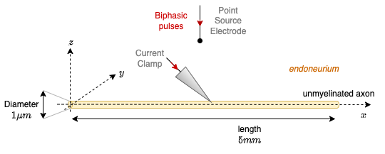

==========
Quickstart
==========

First steps into NRV: a simple axon
===================================

Context
-------

As a very first step, let us consider a simple unmyelinated axon stimulated by an intra and then a extra-cellular electrode. We should initiate 1 action potential per stimulation, that we will place in the center of the axon. We should also be able to observe action potential propagation, in the to directions. The figure bellow illustrate this 

As expected, we will need to use NRV for axonal simulation. We will also use matplotlib to look at results:

::

    import nrv
    import matplotlib.pyplot as plt

Axon declaration
----------------

Axon declaration is pretty straight forward : 

::

    y = 0                       # axon y position, in [um]
    z = 0                       # axon z position, in [um]
    d = 1                       # axon diameter, in [um]
    L = 5000                    # axon length, along x axis, in [um]
    axon1 = nrv.unmyelinated(y,z,d,L)

All axons are alond the x axis, so y and z positions have to be specified. An axon is also defined with a diameter and length. All spacial units in NRV are in micro-metters.

Setting up the stimulation
--------------------------
**Intrcellular stimulation** is a method defined for axons (as well as bundles of fibers in NRV: fascicles and nerve). By default, it allows to setup a pulse defined by a starting time in ms, a duration in ms and an amplitude in nA. It is placed allong the axon in *relative position* (as the axon is 1D-defined along the x axis). This convention is not different from Neuron. Note that there is no restriction on how much clamp you can insert by axon.

Here is the code that setup the intracellular stimulation for the targeted context:

::

    ## Intracellular stimulation definition
    t_start = 0.5               # starting time, in [ms]
    duration = 0.25             # duration, in [ms]
    amplitude = 5               # amplitude, in [nA]
    relative_position = 0.5
    axon1.insert_I_Clamp(relative_position, t_start, duration, amplitude)

**Extracellular stimulation** is defined by different elements:

* one or more electrode(s), here we will use a point source approximated electrode which is a comon first approximation in neuroscience. Extra cellular potential are computed analytically and no geometry has to be specified. More complex or realistic electrodes will be introduced later,

* one or mode material(s), here we will use endoneurium with a typical value

* one or mode stimulus(-i), here we will use a biphasic waveshape typically used on implants.

Below is the code to place the electrode at the mid distance of the axon length, 100 microns away from the fiber:

::

    # electrode
    x_elec = L/2                # electrode x position, in [um]
    y_elec = 100                # electrode y position, in [um]
    z_elec = 0                  # electrode y position, in [um]
    E1 = nrv.point_source_electrode(x_elec,y_elec,z_elec)

you can notice that we created a new object, which is an instance of an abstract Electrode-class. There exist several kind of electrode object with their own properties and geometry, but the way we will handle them in the code is the same.

Here is how to import a material:

::

    # material properties
    epineurium = nrv.load_material('endoneurium_bhadra')

Here is how to specify the waveform:

::

    # stimulus
    start = 2
    I_cathod = 500
    I_anod = I_cathod/5
    T_cathod = 60e-3
    T_inter = 40e-3
    stim1 = nrv.stimulus()
    stim1.biphasic_pulse(start, I_cathod, T_cathod, I_anod, T_inter)

As for the electrode, you can notice that we created a new instance of a Stimulus-object, here called *stim1*. Several methods exist to generate simple stimuli that wee be detailed later.

Now, we do have all the object to describe our context to simulate, however we still need to link all of them. This is done with another object as shown in the code below:

::

    # extracellular stimulation setup
    extra_stim = nrv.stimulation(epineurium)
    extra_stim.add_electrode(E1, stim1)
    axon1.attach_extracellular_stimulation(extra_stim)

an instance of a Stimulation-object is created and the materials associated are specified at the initialisation. Then we need to add a **couple** of electrode and stimulus with the method *add_electrode*. The last line is pretty straight forward and link the material to a geometry, and the electrode with a stimulus to the axon. The context is now fully described.

Simulating everything
---------------------

Simulation is a method for object describing a fiber or a bundle of fibre (axons - myealinated or unmyelinated - fascicles and nerves). The way to start simulation is always the same:

::

    results = axon1.simulate(t_sim=5)
    del axon1

Where the *t_sim* is the simulation duration. Xe don't need anymore the axon, bu all informations, including about what has been declared before a still present in the variable *results*. This variable is a dictionary, containing all information. If you want to explore it, you should print on prompt the keys to see what is stored. This will be fully described latter.

Postprocessing and few comments
-------------------------------

To prove you that the simulation is correct, we will plot the membrane potential along the axon versus time. We need a colormap to do so. In the code below, we use *matplotlib* functions:

::

    plt.figure()
    map = plt.pcolormesh(results['t'], results['x_rec'], results['V_mem'] ,shading='auto')
    plt.xlabel('time (ms)')
    plt.ylabel('position (µm)')
    cbar = plt.colorbar(map)
    cbar.set_label('membrane voltage (mV)')
    plt.show()

you should be able to see the following figure:

.. image:: images/quickstart_result_1.png

In this figure, two V-shapes can be seen:

* the first one corresponds to the intracellular stimulation, it induces a spike at the mid-position of the axon. The spike then propagates along the axon.
* the second one is the spike triggered by the extracellular stimulation. On the sides, one can see hyperpolarization due to positive lobes of the second derivative of the extra-cellularacellular potential from the point source electrode, which is a classical result.

Both spikes propagates at the same speed which is also coherent.

A more realistic example: a simple nerve with a LIFE electrode
==============================================================

currently writting it!