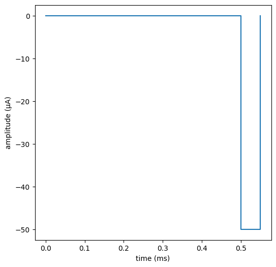
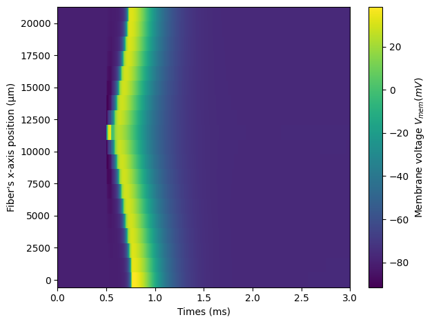
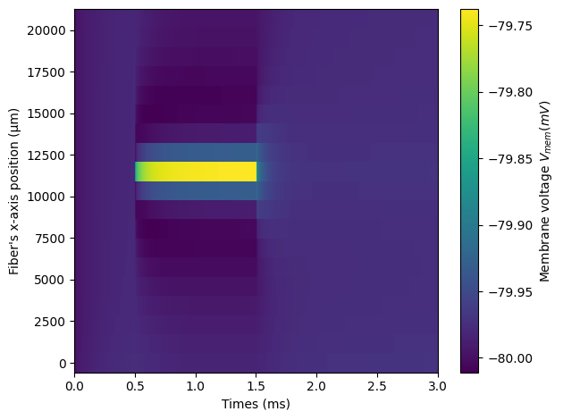
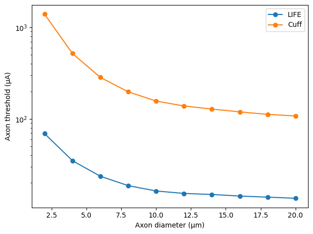

================================================
Tutorial 3 - Stimulating single fibers with NRV
================================================

In this tutorial, we will create a monofascicular nerve, attach it to
one fiber and stimulate it with intra- and extra-fascicular electrodes.
As before, we start by importing the NRV package as well as numpy and
matplotlib:

.. code:: ipython3

    import matplotlib.pyplot as plt
    %matplotlib inline
    import numpy as np
    import sys
    sys.path.append("../")
    import nrv

Axon definition
---------------

Let’s start by creating a 10µm myelinated axon, similarly to previous
tutorials:

.. code:: ipython3

    y_a = 0                                                                     #axon y position, in [µm]
    z_a = 0                                                                     #axon z position, in [µm]
    d_a = 10                                                                    #axon diameter position, in [µm]
    n_NoR = 20                                                                  #number of Node-of-Ranvier
    L_a = nrv.get_length_from_nodes(d_a, n_NoR)                                 #Get the axon length from number of NoR
    axon_m = nrv.myelinated(y_a, z_a, d_a, L_a, model="MRG", rec="nodes")       #we recording only at the node of Ranvier

Extracellular context Creation
------------------------------

We now need to create the extracellular context of our model, which
consists in the nerve and electrode geometry, as well as defining the
material properties. Extracellular context instances are created with
the ``FEM_stimulation``-class. We can also specify the endoneurium
conductivity. Here we will use ``endoneurium_ranck``, and the default
value for the other materials.

.. code:: ipython3

    extra_stim = nrv.FEM_stimulation(endo_mat='endoneurium_ranck')

We can set the diameter of our nerves to 1500µm and length slighly
longer than the axon length (to facilitate FEM computation):

.. code:: ipython3

    d_n = 1500   #in um
    extra_stim.reshape_nerve(d_n,L_a*1.2)

Let’s also set the diameter of the saline outer box to 10mm:

.. code:: ipython3

    d_outbox= 5        #in mm
    extra_stim.reshape_outerBox(d_outbox)

And add a 1000µm fascicle in the nerves:

.. code:: ipython3

    d_f = 1000           #in um
    y_f = 0                 #y pos of the fascicle, in um
    z_f = 0                 #y pos of the fascicle, in um
    extra_stim.reshape_fascicle(Fascicle_D = d_f, y_c=y_f, z_c= z_f)

Finally, we add the electrodes to our FEM models. Let’s start by
creating a 1000µm in length, 25µm in diameter LIFE electrode. The
central point of the LIFE active-site is aligned with the 10th
node-of-ranvier of our fiber, and located 100µm away (on the z-axis)
from the fiber:

.. code:: ipython3

    LIFE_d = 25                         # LIFE's diameter, in um
    LIFE_l = 1000                       # LIFE's active-site length, in um
    x_LIFE = axon_m.x_nodes[n_NoR//2]	# LIFE x position, in [um]
    y_LIFE = 0                          # LIFE y position, in [um]
    z_LIFE = 100                        # LIFE z position, in [um]
    x_LIFE_offset = x_LIFE - (LIFE_l/2)
    LIFE = nrv.LIFE_electrode('LIFE_1', LIFE_d, LIFE_l, x_LIFE_offset, y_LIFE, z_LIFE)

Similarly, we create a monopolar cuff-like electrode:

.. code:: ipython3

    contact_width=500               #width (length) of the cuff active-site, in um
    contact_thickness=100           #tickness of the cuff active-site, in um
    insulator_width=1000            #width (length) of the cuff insulator, in um
    insulator_thickness=500         #tickness of the cuff insulator, in um
    
    x_cuff = axon_m.x_nodes[n_NoR//2] # cuff z position, in [um]
    cuff = nrv.CUFF_electrode('CUFF_1', contact_length=contact_width,
            contact_thickness=contact_thickness, insulator_length=insulator_width,
            insulator_thickness=insulator_thickness, x_center=x_cuff)

Before linking our electrodes to their FEM models, we need to setup a
stimulus. For that, we create a very basic monophasic cathodic 50µs/50µA
pulse:

.. code:: ipython3

    start = 0.5             #start of the pulse, in ms
    I_pulse = 50            #pulse amplitude, in us
    T_pulse = 50*1e-3        #pulse duration, in ms
    stim1 = nrv.stimulus()
    stim1.pulse(start,-I_pulse,T_pulse)

We can plot the stimulus to check it, using built-in plot function of
the ``stimulus``\ class:

.. code:: ipython3

    fig, ax = plt.subplots(1, 1, figsize=(6,6))
    stim1.plot(ax)
    ax.set_xlabel("time (ms)")
    ax.set_ylabel("amplitude (µA)")

We will also create a dummy stimulus, that we will apply to the
electrode we don’t want to use

.. code:: ipython3

    I_pulse_dum = 0.1           #pulse amplitude, in us
    T_pulse_dum = 1
    dummy_stim = nrv.stimulus()
    dummy_stim.pulse(start,-I_pulse_dum,T_pulse_dum)

Electrodes can be simply linked the FEM model by using the
``add_electrode``-method of the ``FEM_stimulation``-object, which
combine an ``electrode``-object to a ``stimulus``-object and attach it
to the FEM model:

.. code:: ipython3

    extra_stim.add_electrode(LIFE, stim1)           #ID = 0
    extra_stim.add_electrode(cuff, dummy_stim)      #not stim on the cuff - ID = 1

ID of electrode is incremented as we add them to the ``extra_stim``:
here the ID for the LIFE is 0 and 1 for the cuff electrode. Let’s write
it to variable, so we don’t mix them later!

.. code:: ipython3

    ID_LIFE = 0
    ID_cuff = 1 

Connecting the FEM model to the axon and simulating it:
-------------------------------------------------------

Now it is time to attach the extracellular context to our axon. It can
be simply be done with the ``attach_extracellular_stimulation``:

.. code:: ipython3

    axon_m.attach_extracellular_stimulation(extra_stim)

And simulate it and save the results:

.. code:: ipython3

    res_LIFE = axon_m(t_sim=3) 

.. parsed-literal::

    NRV INFO: Mesh properties:
    NRV INFO: Number of processes : 3
    NRV INFO: Number of entities : 70
    NRV INFO: Number of nodes : 9567
    NRV INFO: Number of elements : 67397
    NRV INFO: Static/Quasi-Static electrical current problem
    NRV INFO: FEN4NRV: setup the bilinear form
    NRV INFO: FEN4NRV: setup the linear form
    NRV INFO: Static/Quasi-Static electrical current problem
    NRV INFO: FEN4NRV: solving electrical potential
    NRV INFO: FEN4NRV: solved in 5.293697357177734 s
    NRV INFO: Static/Quasi-Static electrical current problem
    NRV INFO: FEN4NRV: solving electrical potential
    NRV INFO: FEN4NRV: solved in 8.822656393051147 s

We can plot the axon’s membrane voltage across time and space with a
colormap:

.. code:: ipython3

    plt.figure()
    map = plt.pcolormesh(res_LIFE["t"], res_LIFE["x_rec"], res_LIFE["V_mem"], shading="auto")
    plt.ylabel("Fiber's x-axis position (µm)")
    plt.xlabel('Times (ms)')
    cbar = plt.colorbar(map)
    cbar.set_label('Membrane voltage $V_{mem} (mV)$')
    plt.tight_layout()

We clearly see that the stimulation generated an action potential in the
axon! We can automatically detect it with the ``is_recruited`` method of
the ``axon_result`` class, which returns true if an AP is detected in
the axon:

.. code:: ipython3

    res_LIFE.is_recruited()

.. parsed-literal::

    True

Now let’s put the ``dummy_stim`` to the LIFE electrode, and re-run the
simulation:

.. code:: ipython3

    axon_m.change_stimulus_from_electrode(ID_LIFE,dummy_stim)
    axon_m.change_stimulus_from_electrode(1,dummy_stim)
    res_LIFE = axon_m(t_sim=3) 
    res_LIFE.is_recruited()

.. parsed-literal::

    False

As expected, no axon is detected as the axon is not being stimulated! We
also observe that the simulation was much faster. Indeed, as long as we
do not change the geometrical properties of the model, we do not need to
re-run the FEM solver again. Let’s plot the axon’s voltage membrane to
verify the statement of the ``is_recruited`` method:

.. code:: ipython3

    plt.figure()
    map = plt.pcolormesh(res_LIFE["t"], res_LIFE["x_rec"], res_LIFE["V_mem"], shading="auto")
    plt.ylabel("Fiber's x-axis position (µm)")
    plt.xlabel('Times (ms)')
    cbar = plt.colorbar(map)
    cbar.set_label('Membrane voltage $V_{mem} (mV)$')
    plt.tight_layout()

And indeed we only see the artifact from the dummy stimulus on the
membrane’s voltage. Now let’s stimulate with the cuff electrode:

.. code:: ipython3

    axon_m.change_stimulus_from_electrode(ID_cuff,stim1)
    res_cuff = axon_m(t_sim=3) 
    res_cuff.is_recruited()

.. parsed-literal::

    False

The axon is not recruited with a 50µs/50µA delivered through the cuff.
Let’s multiply the stimulation current by four:

.. code:: ipython3

    axon_m.change_stimulus_from_electrode(ID_cuff,stim1*4)
    res_cuff = axon_m(t_sim=3) 
    res_cuff.is_recruited()

.. parsed-literal::

    True

Stimulation threshold curves
----------------------------

The minimum current required to recruit a fiber is called the activation
threshold. This threshold depends upon the type of electrode, the nerve
geometry, the axon-to-electrode distance, the shape of the stimulation,
the type and diameter of axon, etc. This section describes how to easily
find the stimulation threshold of an axon, with a defined extracellular
context. For that, we can use the ``firing_threshold_from_axon``
function from NRV. First, let’s put back the ``dummy_sim`` on both
electrodes:

.. code:: ipython3

    axon_m.change_stimulus_from_electrode(ID_cuff,dummy_stim)
    axon_m.change_stimulus_from_electrode(ID_LIFE,dummy_stim)

Currently, the ``firing_threshold_from_axon`` function works only with
biphasic pulse. We will however stay with our monophasic pulse by
setting the anodic current to 0µA. Let’s first get the threshold when
stimulating with LIFE:

.. code:: ipython3

    thr_LIFE = nrv.firing_threshold_from_axon(
        axon = axon_m,                              #axon we're looking the threshold of
        cath_time = T_pulse,                        #pulse duration
        elec_id = ID_LIFE,                          #stimulation electrode ID 
        amp_max = 250,                              #maximum amplitude for the search (in µA)
        amp_tol = 5,                                #search tolerance, in %
        t_sim = 3,                                  #stimulation duration, in ms
        cath_an_ratio = 0,                          #cathodic/anodic ratio: 0 --> cathodic only
    )
    print(f'LIFE threshold: {np.round(thr_LIFE,1)}µA')

.. parsed-literal::

    NRV INFO: Iteration number 1, testing firing current amplitude 250 uA
    NRV INFO: ... Iteration simulation performed in 0.14953279495239258 s
    NRV INFO: ... Spike triggered
    NRV INFO: Iteration number 2, testing firing current amplitude 0 uA
    NRV INFO: ... Iteration simulation performed in 0.1485748291015625 s
    NRV INFO: ... Spike not triggered
    NRV INFO: Iteration number 3, testing firing current amplitude 125.0 uA
    NRV INFO: ... Iteration simulation performed in 0.14812707901000977 s
    NRV INFO: ... Spike triggered
    NRV INFO: Iteration number 4, testing firing current amplitude 62.5 uA
    NRV INFO: ... Iteration simulation performed in 0.14702486991882324 s
    NRV INFO: ... Spike triggered
    NRV INFO: Iteration number 5, testing firing current amplitude 31.25 uA
    NRV INFO: ... Iteration simulation performed in 0.1499006748199463 s
    NRV INFO: ... Spike triggered
    NRV INFO: Iteration number 6, testing firing current amplitude 15.625 uA
    NRV INFO: ... Iteration simulation performed in 0.14605283737182617 s
    NRV INFO: ... Spike not triggered
    NRV INFO: Iteration number 7, testing firing current amplitude 23.4375 uA
    NRV INFO: ... Iteration simulation performed in 0.14760208129882812 s
    NRV INFO: ... Spike triggered
    NRV INFO: Iteration number 8, testing firing current amplitude 19.53125 uA
    NRV INFO: ... Iteration simulation performed in 0.14692091941833496 s
    NRV INFO: ... Spike triggered
    NRV INFO: Iteration number 9, testing firing current amplitude 17.578125 uA
    NRV INFO: ... Iteration simulation performed in 0.1528329849243164 s
    NRV INFO: ... Spike triggered
    NRV INFO: Iteration number 10, testing firing current amplitude 16.6015625 uA
    NRV INFO: ... Iteration simulation performed in 0.14621496200561523 s
    NRV INFO: ... Spike not triggered
    NRV INFO: Iteration number 11, testing firing current amplitude 17.08984375 uA
    NRV INFO: ... Iteration simulation performed in 0.1472630500793457 s
    NRV INFO: ... Spike triggered
    LIFE threshold: 16.8µA

Let’s do the same thing but with the cuff electrode:

.. code:: ipython3

    axon_m.change_stimulus_from_electrode(ID_LIFE,dummy_stim)   #so LIFE is not stimulating
    
    thr_cuff = nrv.firing_threshold_from_axon(
        axon = axon_m,                              #axon we're looking the threshold of
        cath_time = T_pulse,                        #pulse duration
        elec_id = ID_cuff,                          #stimulation electrode ID 
        amp_max = 500,                              #maximum amplitude for the search (in µA)
        amp_tol = 5,                                #search tolerance, in %
        t_sim = 3,                                  #stimulation duration, in ms
        cath_an_ratio = 0,                          #cathodic/anodic ratio: 0 --> cathodic only
    )
    print(f'cuff threshold: {np.round(thr_cuff,1)}µA')

.. parsed-literal::

    NRV INFO: Iteration number 1, testing firing current amplitude 500 uA
    NRV INFO: ... Iteration simulation performed in 0.14757108688354492 s
    NRV INFO: ... Spike triggered
    NRV INFO: Iteration number 2, testing firing current amplitude 0 uA
    NRV INFO: ... Iteration simulation performed in 0.14624691009521484 s
    NRV INFO: ... Spike not triggered
    NRV INFO: Iteration number 3, testing firing current amplitude 250.0 uA
    NRV INFO: ... Iteration simulation performed in 0.15514302253723145 s
    NRV INFO: ... Spike triggered
    NRV INFO: Iteration number 4, testing firing current amplitude 125.0 uA
    NRV INFO: ... Iteration simulation performed in 0.1457509994506836 s
    NRV INFO: ... Spike not triggered
    NRV INFO: Iteration number 5, testing firing current amplitude 187.5 uA
    NRV INFO: ... Iteration simulation performed in 0.14886808395385742 s
    NRV INFO: ... Spike triggered
    NRV INFO: Iteration number 6, testing firing current amplitude 156.25 uA
    NRV INFO: ... Iteration simulation performed in 0.14794421195983887 s
    NRV INFO: ... Spike not triggered
    NRV INFO: Iteration number 7, testing firing current amplitude 171.875 uA
    NRV INFO: ... Iteration simulation performed in 0.15154790878295898 s
    NRV INFO: ... Spike triggered
    NRV INFO: Iteration number 8, testing firing current amplitude 164.0625 uA
    NRV INFO: ... Iteration simulation performed in 0.15180492401123047 s
    NRV INFO: ... Spike triggered
    cuff threshold: 160.2µA

The threshold of LIFE and cuff matches what we observed previously: cuff
electrode requires a much higher current than a LIFE to activate a
fiber. This result makes sens as extrafascicular electrode have
generally a greater electrode-to-axon distance than intrasfascicular
one.

Let’s use the ``firing_threshold_from_axon`` function to plot threshold
vs axon diameter curve, for both when the axon is stimulated with a LIFE
and a cuff. Let’s start with the LIFE (takes several minutes to run):

.. code:: ipython3

    del extra_stim, axon_m                      #to prevent meshing error (known bug)
    
    axon_d_l = [2,4,6,8,10,12,14,16,18,20]        #axon diameter list, in µm
    LIFE_thr_l = []                               #list of results
    n_NoR = 31                                     #increase NoR so small axons are not too short
    nrv.parameters.set_nrv_verbosity(i=2)          #so we don't get overflooded with infos
    
    for axon_d in axon_d_l:
    
        #we create a new axon
        L_a = nrv.get_length_from_nodes(axon_d, n_NoR)                              
        new_axon = nrv.myelinated(y=y_a, z=z_a, d=axon_d, L=L_a, model='MRG', rec='nodes')
    
        #we create a corresponding extracellular context
        extra_stim_f = nrv.FEM_stimulation(endo_mat='endoneurium_ranck')
        extra_stim_f.reshape_nerve(d_n,L_a)
        extra_stim_f.reshape_outerBox(d_outbox)
        extra_stim_f.reshape_fascicle(Fascicle_D = d_f, y_c=y_f, z_c= z_f)
    
        #same for the LIFE
        x_LIFE = new_axon.x_nodes[n_NoR//2]	# LIFE x position, in [um]
        x_LIFE_offset = x_LIFE - (LIFE_l/2)
        new_LIFE = nrv.LIFE_electrode('LIFE_1', LIFE_d, LIFE_l, x_LIFE_offset, y_LIFE, z_LIFE)
        extra_stim_f.add_electrode(new_LIFE, dummy_stim)  #ID = 0
    
        #link the extrastim with the axon: 
        new_axon.attach_extracellular_stimulation(extra_stim_f)
        new_axon.get_electrodes_footprints_on_axon()
    
        thr_LIFE = nrv.firing_threshold_from_axon(axon = new_axon,cath_time = T_pulse, 
        elec_id = 0,amp_max = 100,amp_tol = 2,t_sim = 3,cath_an_ratio = 0, verbose = False)  
        del extra_stim_f, new_axon                       #to prevent meshing error (known bug)
    
        print(f'LIFE threshold: {np.round(thr_LIFE,1)}µA (axon_d = {axon_d}µm)')                        
        LIFE_thr_l.append(thr_LIFE)

.. parsed-literal::

    LIFE threshold: 69.1µA (axon_d = 2µm)
    LIFE threshold: 35.0µA (axon_d = 4µm)
    LIFE threshold: 23.6µA (axon_d = 6µm)
    LIFE threshold: 18.7µA (axon_d = 8µm)
    LIFE threshold: 16.3µA (axon_d = 10µm)
    LIFE threshold: 15.3µA (axon_d = 12µm)
    LIFE threshold: 14.9µA (axon_d = 14µm)
    LIFE threshold: 14.4µA (axon_d = 16µm)
    LIFE threshold: 14.0µA (axon_d = 18µm)
    LIFE threshold: 13.6µA (axon_d = 20µm)

Let’s to the same curve but with a cuff electrode this time:

.. code:: ipython3

    cuff_thr_l = []                               #list of results
    
    for axon_d in axon_d_l:
    
        #we create a new axon
        L_a = nrv.get_length_from_nodes(axon_d, n_NoR)                              
        new_axon = nrv.myelinated(y=y_a, z=z_a, d=axon_d, L=L_a, model='MRG', rec='nodes')
    
        #we create a corresponding extracellular context
        extra_stim_f = nrv.FEM_stimulation(endo_mat='endoneurium_ranck')
        extra_stim_f.reshape_nerve(d_n,L_a)
        extra_stim_f.reshape_outerBox(d_outbox)
        extra_stim_f.reshape_fascicle(Fascicle_D = d_f, y_c=y_f, z_c= z_f)
    
        #same for the LIFE
        x_cuff = new_axon.x_nodes[n_NoR//2] # cuff z position, in [um]
        new_cuff = nrv.CUFF_electrode('CUFF_1', contact_length=contact_width,
                contact_thickness=contact_thickness, insulator_length=insulator_width,
                insulator_thickness=insulator_thickness, x_center=x_cuff)
        extra_stim_f.add_electrode(new_cuff, dummy_stim)  #ID = 0
    
        #link the extrastim with the axon: 
        new_axon.attach_extracellular_stimulation(extra_stim_f)
        new_axon.get_electrodes_footprints_on_axon()
    
        thr_cuff = nrv.firing_threshold_from_axon(axon = new_axon,cath_time = T_pulse, 
        elec_id = 0,amp_max = 1500,amp_tol = 2,t_sim = 3,cath_an_ratio = 0, verbose = False)  
        del extra_stim_f, new_axon                       #to prevent meshing error (known bug)
    
        print(f'LIFE threshold: {np.round(thr_cuff,1)}µA (axon_d = {axon_d}µm)')                        
        cuff_thr_l.append(thr_cuff)

.. parsed-literal::

    LIFE threshold: 1394.5µA (axon_d = 2µm)
    LIFE threshold: 518.6µA (axon_d = 4µm)
    LIFE threshold: 284.2µA (axon_d = 6µm)
    LIFE threshold: 197.8µA (axon_d = 8µm)
    LIFE threshold: 156.7µA (axon_d = 10µm)
    LIFE threshold: 138.4µA (axon_d = 12µm)
    LIFE threshold: 128.2µA (axon_d = 14µm)
    LIFE threshold: 119.4µA (axon_d = 16µm)
    LIFE threshold: 112.1µA (axon_d = 18µm)
    LIFE threshold: 107.7µA (axon_d = 20µm)

Now we can plot the results to compare the recruitment properties of the
two tested electrodes:

.. code:: ipython3

    plt.figure()
    plt.semilogy(axon_d_l,LIFE_thr_l,'o-',label = 'LIFE')
    plt.semilogy(axon_d_l,cuff_thr_l,'o-',label = 'Cuff')
    plt.legend()
    plt.xlabel("Axon diameter (µm)")
    plt.ylabel("Axon threshold (µA)")
    plt.tight_layout()

