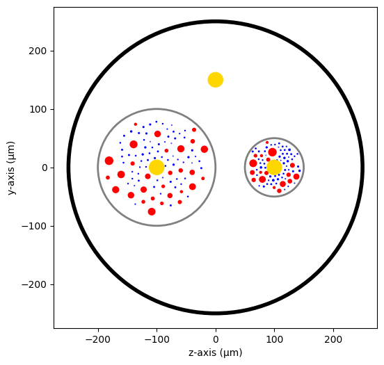
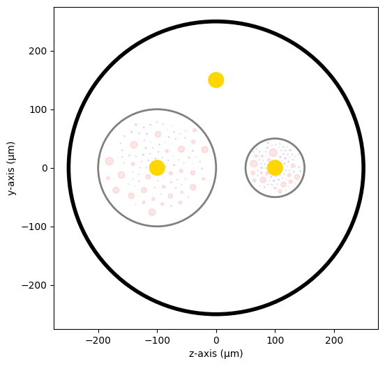
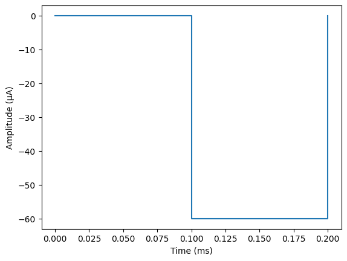
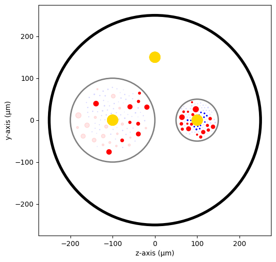
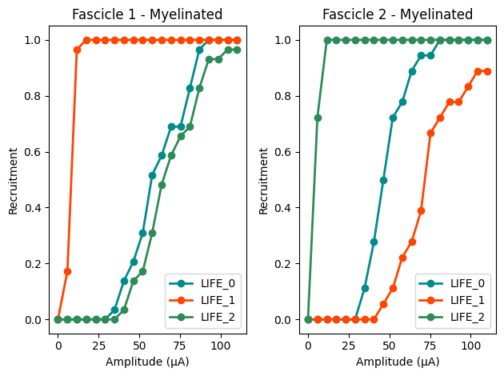
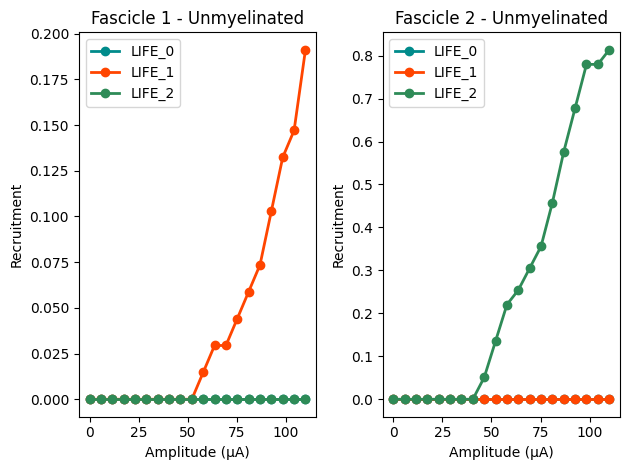
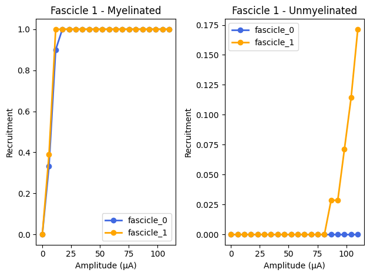

========================================
Tutorial 4 - Stimulating nerves with NRV
========================================

In this tutorial, we will create a 2-fascicle nerve, populate it with
axons and stimulate it with intra- and extra-fascicular electrodes.

As before, we start by importing the NRV package as well as numpy and
matplotlib:

.. code:: ipython3

    import matplotlib.pyplot as plt
    %matplotlib inline
    import numpy as np
    import nrv

Nerve creation
--------------

First, we need to create our nerve object using the NRV’s
``nerve``-class. This object contains the geometrical properties of the
nerve. NRV currently only supports cylindrical shapes for nerve, thus a
diameter (``nerve_d``) and a length (``nerve_l``) must be specified at
the nerve creation. The ``Outer_D`` parameter can also be specified. It
refers to the saline solution bath diameter in which the nerve is
plunged into.

.. code:: ipython3

    outer_d = 5         # in mm
    nerve_d = 500       # in um
    nerve_l = 5000      # in um
    nerve = nrv.nerve(length=nerve_l, diameter=nerve_d, Outer_D=outer_d)

Then, we will add two fascicles to the nerve. Fascicles in NRV are
cylindrical shapes defined by their diameter and their (y,z) coordinates
in space. The (0,0) coordinate is aligned with the center of the nerve.
Fascicle are defined with the NRV’s ``fascicle``-class. The ``ÌD``
parameters of the ``fascicle``-object tags each fascicle of the model
which will facilitate the post-simulation analysis. Fascicle are
incorporated one by one to the ``nerve``-object using the
``add_fascicle``-method. We can now plot a 2-D section of the nerve with
the ``plot``\ method of the ``nerve``-object to visualize it.

.. code:: ipython3

    fasc1_d = 200       # in um
    fasc1_y = -100      # in um
    fasc1_z = 0         # in um
    
    fasc2_d = 100       # in um
    fasc2_y = 100       # in um
    fasc2_z = 0         # in um
    
    #create the fascicle objects
    fascicle_1 = nrv.fascicle(diameter=fasc1_d,ID=1)      
    fascicle_2 = nrv.fascicle(diameter=fasc2_d, ID=2)
    
    #Add the fascicles to the nerve
    nerve.add_fascicle(fascicle=fascicle_1, y=fasc1_y, z=fasc1_z)
    nerve.add_fascicle(fascicle=fascicle_2, y=fasc2_y, z=fasc2_z)
    
    #plot
    fig, ax = plt.subplots(1, 1, figsize=(6,6))
    nerve.plot(ax)
    ax.set_xlabel("z-axis (µm)")
    ax.set_ylabel("y-axis (µm)")

.. image:: ../images/4_nerve_simulation_5_1.png

Populate fascicles with axons
-----------------------------

Now that our nerve is created, it is time to populate them with axons.
The first step is to create the population. In this example, we will
populate each fascicle with myelinated and unmyelinated axons, with a
total of 100 axons in each fascicle. To create a realistic axon diameter
distribution, we use the NRV’s ``create_axon_population``-method. The
function take for arguments: \* the number of axon in the population
``n_ax`` \* the proportion of unmyelinated fibers in the population
``percent_unmyel`` \* the myelinated axon distribution ``M_stat`` \* the
unmyelinated axon distribution ``U_stat``

Available myelinated and unmyelinated axon distributions are described
in xxx.

The ``create_axon_population``\ method returns four numpy arrays: \*
``axons_diameters``\ which contains the diameter of each axon of the
population. \* ``axon_type`` containing a ‘1’ value for indexes where
the axon is myelinated, else ‘0’. \* ``M_diam_list`` the diameter of
myelinated axons only \* ``U_diam_list`` the diameter of unmyelinated
axons only

.. code:: ipython3

    n_ax = 100      #size of the axon population
    axons_diameters, axons_type, M_diam_list, U_diam_list = nrv.create_axon_population(n_ax, percent_unmyel=0.7, M_stat="Ochoa_M", U_stat="Ochoa_U",)

.. code:: ipython3

    fascicle_1.fill_with_population(axons_diameters, axons_type, delta=5)

Let’s repeat this operation for the 2nd fascicle and plot the nerve
again:

.. code:: ipython3

    axons_diameters, axons_type, M_diam_list, U_diam_list = nrv.create_axon_population(n_ax, percent_unmyel=0.7, M_stat="Ochoa_M", U_stat="Ochoa_U",)
    fascicle_2.fill_with_population(axons_diameters, axons_type, delta=5)
    
    #Plot the nerve again.
    fig, ax = plt.subplots(1, 1, figsize=(6,6))
    nerve.plot(ax)
    ax.set_xlabel("z-axis (µm)")
    ax.set_ylabel("y-axis (µm)")

.. image:: ../images/4_nerve_simulation_11_4.png

.. code:: ipython3

    fascicle_1.fit_population_to_size(delta = 2)    
    fig, ax = plt.subplots(1, 1, figsize=(6,6))     
    nerve.plot(ax)
    ax.set_xlabel("z-axis (µm)")
    ax.set_ylabel("y-axis (µm)")

.. image:: ../images/4_nerve_simulation_13_1.png

While we are here, we can also define stimulation parameters of the
axons. For example, we can specify the computational model of the
myelinated and unmyelinated fibers. You can refer to the previous
tutorials for a thorough overview of the fiber’s simulation parameters
available.

.. code:: ipython3

    m_model = 'MRG'
    um_model = 'Rattay_Aberham'
    u_param = {"model": um_model}
    m_param = {"model": m_model}
    
    #For fascicle1
    fascicle_1.set_axons_parameters(unmyelinated_only=True,**u_param)
    fascicle_1.set_axons_parameters(myelinated_only=True,**m_param)
    
    #For fascicle2
    fascicle_2.set_axons_parameters(unmyelinated_only=True,**u_param)
    fascicle_2.set_axons_parameters(myelinated_only=True,**m_param)

Extracellular stimulation context
---------------------------------

Now we will define everything related to the extracellular stimulation.
First, we need to create a ``FEM_stimulation``-object. In this object,
we can specify the conductivity of each material of the FEM stimulation.
Available material conductivities are specified in xxx.

.. code:: ipython3

    extra_stim = nrv.FEM_stimulation(endo_mat="endoneurium_ranck",      #endoneurium conductivity
                                     peri_mat="perineurium",            #perineurium conductivity
                                     epi_mat="epineurium",              #epineurium conductivity
                                     ext_mat="saline")                  #saline solution conductivity

Adding intracellular electrodes
~~~~~~~~~~~~~~~~~~~~~~~~~~~~~~~

First, we will run some simulation with 3 intrafascicular LIFE-like
electrodes, using the ``LIFE_electrode`` NRV’s object. In NRV, LIFEs are
defined by a diameter (``life_d``), an active-site length
(``life_length``) and a (x,y,z) spatial coordinates. A label and an ID
can also be specified to facilitate post-simulation analysis. In this
example we aligned the LIFEs x-position to the middle of the nerve, and
set their (y,z) coordinates such that: - ``LIFE_0`` is located inside
the nerve but outside the fascicles - ``LIFE_1`` is located inside
``fascicle_1`` - ``LIFE_2`` is located inside ``fascicle_2``

The electrodes are attached to the ``extra_stim``
``FEM_stimulation``-object with the ``add_electrode``-method. The method
also requires to link the electrode to a NRV ``stimulus``-object. For
that, we created a dummy stimulus ``dummy_stim``\ that we will change
later.

.. code:: ipython3

    life_d = 25                                 #LIFE diamter in um
    life_length = 1000                          #LIFE active-site length in um
    life_x_offset = (nerve_l-life_length)/2     #x position of the LIFE (centered)
    
    life_y_c_0 = 0                              #LIFE_0 y-coordinate (in um)
    life_z_c_0 = 150                            #LIFE_0 z-coordinate (in um)
    life_y_c_1 = fasc1_y                        #LIFE_1 y-coordinate (in um)
    life_z_c_1 = fasc1_z                        #LIFE_1 z-coordinate (in um)
    life_y_c_2 = fasc2_y                        #LIFE_2 y-coordinate (in um)
    life_z_c_2 = fasc2_z                        #LIFE_1 z-coordinate (in um)
    
    elec_0 = nrv.LIFE_electrode("LIFE_0", life_d, life_length, life_x_offset, life_y_c_0, life_z_c_0, ID = 0) # LIFE in neither of the two fascicles
    elec_1 = nrv.LIFE_electrode("LIFE_1", life_d, life_length, life_x_offset, life_y_c_1, life_z_c_1, ID = 1) # LIFE in the fascicle 1
    elec_2 = nrv.LIFE_electrode("LIFE_2", life_d, life_length, life_x_offset, life_y_c_2, life_z_c_2, ID = 2) # LIFE in the fascicle 2
    
    #Dummy stimulus
    dummy_stim = nrv.stimulus()
    dummy_stim.pulse(0, 0.1, 1)
    
    #Attach electrodes to the extra_stim object 
    extra_stim.add_electrode(elec_0, dummy_stim)
    extra_stim.add_electrode(elec_1, dummy_stim)
    extra_stim.add_electrode(elec_2, dummy_stim)

Last, we attach ``extra_stim``-object to the nerve with the
``attach_extracellular_stimulation``-method:

.. code:: ipython3

    nerve.attach_extracellular_stimulation(extra_stim)

Let’s see how our nerve with electrodes now looks like:

.. code:: ipython3

    fig, ax = plt.subplots(1, 1, figsize=(6,6))
    nerve.plot(ax)
    ax.set_xlabel("z-axis (µm)")
    ax.set_ylabel("y-axis (µm)")

.. code:: ipython3

    nerve.save_results = False
    nerve.return_parameters_only = False
    nerve.verbose = True
    nerve_results = nerve(t_sim=1,postproc_script = "AP_detection")         #Run the simulation

We can plot the nerve again and highlight axons that are recruited:

.. code:: ipython3

    fig, ax = plt.subplots(1, 1, figsize=(6,6))
    nerve_results.plot_recruited_fibers(ax)
    ax.set_xlabel("z-axis (µm)")
    ax.set_ylabel("y-axis (µm)")

No fiber activated are activated, of course the electrodes are
stimulating with the ``dummy_stim``\ stimulus! Let’s change the stimulus
of ``LIFE_2`` (in ``fascicle_2``) with a 100µs-long 60µA monophasic
cathodic pulse:

.. code:: ipython3

    t_start = 0.1       #start of the pulse, in ms
    t_pulse = 0.1       #duration of the pulse, in ms
    amp_pulse = 60      #amplitude of the pulse, in uA 
    
    pulse_stim = nrv.stimulus()
    pulse_stim.pulse(t_start, -amp_pulse, t_pulse)      #cathodic pulse
    
    fig, ax = plt.subplots()                            #plot it
    pulse_stim.plot(ax) #
    ax.set_ylabel("Amplitude (µA)")
    ax.set_xlabel("Time (ms)")

We can change the stimulus of ``LIFE_2`` by calling
``change_stimulus_from_elecrode`` of the ``nerve``-object with the
``LIFE_2`` ID and the new stimulus. We then re-run the simulation and
plot the activated fibers.

.. code:: ipython3

    nerve.change_stimulus_from_elecrode(ID_elec=2,stimulus=pulse_stim)
    nerve_results = nerve(t_sim=3,postproc_script = "AP_detection")
    
    fig, ax = plt.subplots(1, 1, figsize=(6,6))
    nerve_results.plot_recruited_fibers(ax)
    ax.set_xlabel("z-axis (µm)")
    ax.set_ylabel("y-axis (µm)")

.. code:: ipython3

    fasc_results = nerve_results.get_fascicle_results(ID = 1)              #get results in fascicle 1
    unmyel = fasc_results.get_recruited_axons('unmyelinated')              #get ratio of unmyelinated axon activated in fascicle 1
    myel = fasc_results.get_recruited_axons('myelinated')                  #get ratio of myelinated axon activated in fascicle 1
    
    print(f"Proportion of unmyelinated recruited in fascicle_1: {unmyel*100}%")
    print(f"Proportion of myelinated recruited in fascicle_1: {myel*100}%")
    
    fasc_results = nerve_results.get_fascicle_results(ID = 2)              #get results in fascicle 2
    unmyel = fasc_results.get_recruited_axons('unmyelinated')              #get ratio of unmyelinated axon activated in fascicle 2
    myel = fasc_results.get_recruited_axons('myelinated')                  #get ratio of myelinated axon activated in fascicle 2
    
    print(f"Proportion of unmyelinated recruited in fascicle_2: {unmyel*100}%")
    print(f"Proportion of myelinated recruited in fascicle_2: {myel*100}%")

.. parsed-literal::

    Proportion of unmyelinated recruited in fascicle_1: 0.0%
    Proportion of myelinated recruited in fascicle_1: 34.48275862068966%
    Proportion of unmyelinated recruited in fascicle_2: 22.033898305084744%
    Proportion of myelinated recruited in fascicle_2: 100.0%

Let’s remove the stimulation in ``LIFE_2`` and apply it via ``LIFE_0``
instead:

.. code:: ipython3

    nerve.change_stimulus_from_elecrode(ID_elec=0,stimulus=pulse_stim)
    nerve.change_stimulus_from_elecrode(ID_elec=2,stimulus=dummy_stim)
    nerve_results = nerve(t_sim=3,postproc_script = "AP_detection")

Let’s see how many fibers are activated now:

.. code:: ipython3

    fasc_results = nerve_results.get_fascicle_results(ID = 1)              #get results in fascicle 1
    unmyel = fasc_results.get_recruited_axons('unmyelinated')              #get ratio of unmyelinated axon activated in fascicle 1
    myel = fasc_results.get_recruited_axons('myelinated')                  #get ratio of myelinated axon activated in fascicle 1
    
    print(f"Proportion of unmyelinated recruited in fascicle_1: {unmyel*100}%")
    print(f"Proportion of myelinated recruited in fascicle_1: {myel*100}%")
    
    fasc_results = nerve_results.get_fascicle_results(ID = 2)              #get results in fascicle 2
    unmyel = fasc_results.get_recruited_axons('unmyelinated')              #get ratio of unmyelinated axon activated in fascicle 2
    myel = fasc_results.get_recruited_axons('myelinated')                  #get ratio of myelinated axon activated in fascicle 2
    
    print(f"Proportion of unmyelinated recruited in fascicle_2: {unmyel*100}%")
    print(f"Proportion of myelinated recruited in fascicle_2: {myel*100}%")
    
    fig, ax = plt.subplots(figsize=(8, 8))
    nerve_results.plot_recruited_fibers(ax)
    ax.set_xlabel("z-axis (µm)")
    ax.set_ylabel("y-axis (µm)")

.. parsed-literal::

    Proportion of unmyelinated recruited in fascicle_1: 0.0%
    Proportion of myelinated recruited in fascicle_1: 58.620689655172406%
    Proportion of unmyelinated recruited in fascicle_2: 0.0%
    Proportion of myelinated recruited in fascicle_2: 83.33333333333334%

.. image:: ../images/4_nerve_simulation_37_2.png

We see that the recruitment profile in the fascicles is very different
whether we stimulate with one or another electrode. We can analyze it by
plotting recruitment curves.

Recruitment curves with LIFEs
-----------------------------

To build the recruitment curve of our three electrodes, we are going to
create a quick python function ``get_recruitment_electrode``\ that take
as argument and electrode ID and a numpy array containing the pulse
amplitude for the curve. The function return the ratio of myelinated and
unmyelinated fibers recruited in each fascicle in python list.

.. code:: ipython3

    def get_recruitment_electrode(elec_ID:int, amp_vec:np.array) -> list:
    
        nerve.verbose = False
    
        #create empty list to store results
        unmyel_fasc1,myel_fasc1,unmyel_fasc2,myel_fasc2 = ([] for i in range(4))
    
        #Deactivate unused electrodes
        elec_IDs = [0,1,2]
        unused_elec = [x for x in elec_IDs if elec_ID != x]
        for elec in unused_elec:
            nerve.change_stimulus_from_elecrode(ID_elec=elec,stimulus=dummy_stim)   
    
        #Loop throught amp_vec
        print(f"Stimulating nerve with LIFE_{elec_ID}")
        for idx,amp in enumerate(amp_vec):
            amp = np.round(amp,1)                                                       #get the amplitude
            print(f"Pulse amplitude set to {-amp}µA ({idx+1}/{len(amp_vec)})")
            pulse_stim = nrv.stimulus()                                                 #create a new empty stimulus
            pulse_stim.pulse(t_start, -amp, t_pulse)                                    #create a pulse with the new amplitude
            nerve.change_stimulus_from_elecrode(ID_elec=elec_ID,stimulus=pulse_stim)    #attach stimulus to selected electrode
            nerve_results = nerve(t_sim=3,postproc_script = "AP_detection")             #run the simulation
    
            #add results to lists
            fasc_results = nerve_results.get_fascicle_results(ID = 1)
            unmyel_fasc1.append(fasc_results.get_recruited_axons('unmyelinated'))
            myel_fasc1.append(fasc_results.get_recruited_axons('myelinated'))
            fasc_results = nerve_results.get_fascicle_results(ID = 2)
            unmyel_fasc2.append(fasc_results.get_recruited_axons('unmyelinated'))
            myel_fasc2.append(fasc_results.get_recruited_axons('myelinated'))
        return(unmyel_fasc1,myel_fasc1,unmyel_fasc2,myel_fasc2)

.. code:: ipython3

    amp_min = 0             #start at 0µA 
    amp_max = 110           #ends at 150µA 
    n_amp = 20              #20pts 
    amp_vec = np.linspace(amp_min,amp_max,n_amp)
    
    unmyel_fasc1_LIFE0,myel_fasc1_LIFE0,unmyel_fasc2_LIFE0, myel_fasc2_LIFE0 = get_recruitment_electrode(0,amp_vec)
    unmyel_fasc1_LIFE1,myel_fasc1_LIFE1,unmyel_fasc2_LIFE1, myel_fasc2_LIFE1 = get_recruitment_electrode(1,amp_vec)
    unmyel_fasc1_LIFE2,myel_fasc1_LIFE2,unmyel_fasc2_LIFE2, myel_fasc2_LIFE2 = get_recruitment_electrode(2,amp_vec)

Now let’s look at the results for myelinated fibers:

.. code:: ipython3

    c_LIFE_0 = "darkcyan"
    c_LIFE_1 = "orangered"
    c_LIFE_2 = "seagreen"
    
    fig, (ax1, ax2) = plt.subplots(1, 2)
    
    ax1.plot(amp_vec,myel_fasc1_LIFE0, '-o', lw=2, color= c_LIFE_0, label = 'LIFE_0')
    ax1.plot(amp_vec,myel_fasc1_LIFE1, '-o', lw=2, color= c_LIFE_1, label = 'LIFE_1')
    ax1.plot(amp_vec,myel_fasc1_LIFE2, '-o', lw=2, color= c_LIFE_2, label = 'LIFE_2')
    ax1.set_title("Fascicle 1 - Myelinated")
    
    ax2.plot(amp_vec,myel_fasc2_LIFE0, '-o', lw=2, color= c_LIFE_0, label = 'LIFE_0')
    ax2.plot(amp_vec,myel_fasc2_LIFE1, '-o', lw=2, color= c_LIFE_1, label = 'LIFE_1')
    ax2.plot(amp_vec,myel_fasc2_LIFE2, '-o', lw=2, color= c_LIFE_2, label = 'LIFE_2')
    ax2.set_title("Fascicle 2 - Myelinated")
    
    for ax in ax1, ax2:
        ax.set_xlabel('Amplitude (µA)')
        ax.set_ylabel('Recruitment')
        ax.legend()
        
    fig.tight_layout()

.. code:: ipython3

    fig, (ax1, ax2) = plt.subplots(1, 2)
    ax1.plot(amp_vec,unmyel_fasc1_LIFE0, '-o', lw=2, color= c_LIFE_0, label = 'LIFE_0')
    ax1.plot(amp_vec,unmyel_fasc1_LIFE1, '-o', lw=2, color= c_LIFE_1, label = 'LIFE_1')
    ax1.plot(amp_vec,unmyel_fasc1_LIFE2, '-o', lw=2, color= c_LIFE_2, label = 'LIFE_2')
    ax1.set_title("Fascicle 1 - Unmyelinated")
    
    ax2.plot(amp_vec,unmyel_fasc2_LIFE0, '-o', lw=2, color= c_LIFE_0, label = 'LIFE_0')
    ax2.plot(amp_vec,unmyel_fasc2_LIFE1, '-o', lw=2, color= c_LIFE_1, label = 'LIFE_1')
    ax2.plot(amp_vec,unmyel_fasc2_LIFE2, '-o', lw=2, color= c_LIFE_2, label = 'LIFE_2')
    ax2.set_title("Fascicle 2 - Unmyelinated")
    
    for ax in ax1, ax2:
        ax.set_xlabel('Amplitude (µA)')
        ax.set_ylabel('Recruitment')
        ax.legend()
        
    fig.tight_layout()

Activation of unmyelinated fibers requires much higher pulse amplitude.
Electrodes located in the fascicle recruits at most about 10% of the
unmyelinated fibers in ``fascicle_1`` and about 70% in ``fascicle_2``.
Electrode outside the fascicle or located in the other one fail at
recruiting myelinated fibers.

Recruitment curves with a monopolar cuff-like electrode
-------------------------------------------------------

Let’s create a second nerve with a cuff electrode now:

.. code:: ipython3

    #creating the fascicles are populating them
    fascicle_1_c = nrv.fascicle(diameter=fasc1_d,ID=1)      
    fascicle_2_c = nrv.fascicle(diameter=fasc2_d, ID=2)
    fascicle_1_c.fill_with_population(axons_diameters, axons_type, delta=5, fit_to_size = True)
    fascicle_2_c.fill_with_population(axons_diameters, axons_type, delta=5, fit_to_size = True)
    
    #set simulation parameters
    fascicle_1_c.set_axons_parameters(unmyelinated_only=True,**u_param)
    fascicle_1_c.set_axons_parameters(myelinated_only=True,**m_param)
    fascicle_2_c.set_axons_parameters(unmyelinated_only=True,**u_param)
    fascicle_2_c.set_axons_parameters(myelinated_only=True,**m_param)
    
    #create the nerve and add fascicles
    nerve_cuff = nrv.nerve(length=nerve_l, diameter=nerve_d, Outer_D=outer_d)
    nerve_cuff.add_fascicle(fascicle=fascicle_1_c, y=fasc1_y, z=fasc1_z)
    nerve_cuff.add_fascicle(fascicle=fascicle_2_c, y=fasc2_y, z=fasc2_z)
    
    #set the simulation flags
    nerve_cuff.save_results = False
    nerve_cuff.return_parameters_only = False
    nerve_cuff.verbose = True

We now create a FEM stimulation context, create a cuff electrode using
the ``CUFF_electrode``-class, combine everything and add it to the
``nerve_cuff``-object:

.. code:: ipython3

    extra_stim_cuff = nrv.FEM_stimulation(endo_mat="endoneurium_ranck",      #endoneurium conductivity
                                     peri_mat="perineurium",            #perineurium conductivity
                                     epi_mat="epineurium",              #epineurium conductivity
                                     ext_mat="saline")                  #saline solution conductivity
    
    contact_length=1000         # length (width) of the cuff contact, in um
    contact_thickness=100       # thickness of the contact, in um
    insulator_length=1500       # length (width) of the cuff insulator, on top of the contact
    insulator_thickness=500     # thickness of the in insulator
    x_center = nerve_l/2        # x-position of the cuff
    
    cuff_1 = nrv.CUFF_electrode('CUFF', contact_length=contact_length,
        contact_thickness=contact_thickness, insulator_length=insulator_length,
        insulator_thickness=insulator_thickness, x_center=x_center)
    
    extra_stim_cuff.add_electrode(cuff_1, dummy_stim)
    nerve_cuff.attach_extracellular_stimulation(extra_stim_cuff)
    
    fig, ax = plt.subplots(figsize=(8, 8))
    nerve_cuff.plot(ax)

.. image:: ../images/4_nerve_simulation_50_0.png

We can now simulate a recruitment curve with a cuff just like we did
with the LIFE electrodes:

.. code:: ipython3

    
    nerve_cuff.save_results = False
    nerve_cuff.return_parameters_only = False
    nerve_cuff.verbose = False
    
    #create empty list to store results
    unmyel_fasc1_cuff,myel_fasc1_cuff,unmyel_fasc2_cuff,myel_fasc2_cuff = ([] for i in range(4))
    
    #Loop throught amp_vec
    print(f"Stimulating nerve with CUFF")
    for idx,amp in enumerate(amp_vec):
        amp = np.round(amp,1)                                                       #get the amplitude
        print(f"Pulse amplitude set to {-amp}µA ({idx+1}/{len(amp_vec)})")
        pulse_stim = nrv.stimulus()                                                 #create a new empty stimulus
        pulse_stim.pulse(t_start, -amp, t_pulse)                                    #create a pulse with the new amplitude
        nerve_cuff.change_stimulus_from_elecrode(ID_elec=0,stimulus=pulse_stim)          #attach stimulus to selected electrode
        nerve_results = nerve_cuff(t_sim=3,postproc_script = "AP_detection")             #run the simulation
    
        #add results to lists
        fasc_results = nerve_results.get_fascicle_results(ID = 1)
        unmyel_fasc1_cuff.append(fasc_results.get_recruited_axons('unmyelinated'))
        myel_fasc1_cuff.append(fasc_results.get_recruited_axons('myelinated'))
        fasc_results = nerve_results.get_fascicle_results(ID = 2)
        unmyel_fasc2_cuff.append(fasc_results.get_recruited_axons('unmyelinated'))
        myel_fasc2_cuff.append(fasc_results.get_recruited_axons('myelinated'))

And plot the results:

.. code:: ipython3

    c_fascicle_0 = "royalblue"
    c_fascicle_1 = "orange"
    
    fig, (ax1, ax2) = plt.subplots(1, 2)
    ax1.plot(amp_vec,myel_fasc1_cuff, '-o', lw=2, color= c_fascicle_0, label = 'fascicle_0')
    ax1.plot(amp_vec,myel_fasc2_cuff, '-o', lw=2, color= c_fascicle_1, label = 'fascicle_1')
    ax1.set_title("Fascicle 1 - Myelinated")
    
    ax2.plot(amp_vec,unmyel_fasc1_cuff, '-o', lw=2, color= c_fascicle_0, label = 'fascicle_0')
    ax2.plot(amp_vec,unmyel_fasc2_cuff, '-o', lw=2, color= c_fascicle_1, label = 'fascicle_1')
    ax2.set_title("Fascicle 1 - Unmyelinated")
    
    for ax in ax1, ax2:
        ax.set_xlabel('Amplitude (µA)')
        ax.set_ylabel('Recruitment')
        ax.legend()
        
    fig.tight_layout()

