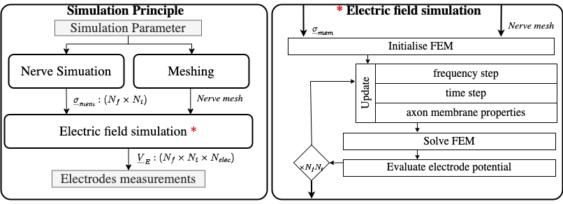
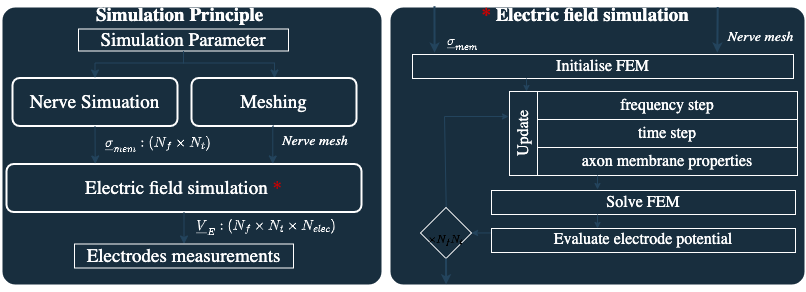

===============================
Electrical Impedance Tomography
===============================

NRV includes an integrated optimization layer, enabling direct tuning of input parameters to optimize the outcomes of simulations.

.. seealso::

    :doc:`Tutorial 6 </tutorials/6_play_with_eit>` --- Play with EIT using NRV

Overview
--------

Electrical Impedance Tomography (EIT) is a technique for imaging the conductivity distribution within neural tissue by injecting currents and measuring resulting voltages at multiple electrodes. NRV provides a dedicated subpackage, ``nrv.eit``, for simulating both the forward and inverse EIT problems, including mesh generation, protocol management, and result analysis.

Forward Problem
---------------

Run the simulation
~~~~~~~~~~~~~~~~~~

In NRV, a forward EIT simulation is divided into three distinct steps:

- **Nerve simulation**: Models the neural activity and computes the time-dependent changes in axonal membrane conductivity. This step uses NRV's nerve and fascicle classes, and can include intracellular stimulation and subpopulation selection.
- **Meshing**: Generates the finite element mesh for the nerve geometry, including fascicles and electrodes. Mesh generation is handled by GMSH and FEniCSx libraries, and is fully integrated in NRV's EIT classes.
- **Electric field simulation**: Solves the FEM problem to compute the voltage field inside the nerve for a given stimulation protocol and electrode configuration.

All these steps are gathered in the abstract class ``eit_forward``, with two main usable daughter classes:
- :class:`nrv.eit.EIT2DProblem` for 2D simulations
- :class:`nrv.eit.EIT3DProblem` for 3D simulations

Typical workflow
~~~~~~~~~~~~~~~~

A typical forward EIT simulation involves:

1. Defining the nerve geometry and fascicles, and filling them with axon populations.
2. Setting up the electrode configuration and stimulation protocol.
3. Instantiating an EIT problem object (e.g., :class:`nrv.eit.EIT2DProblem`) with the nerve and protocol parameters.
4. Running the nerve simulation to compute membrane conductivity changes.
5. Building the FEM mesh and running the EIT simulation to obtain voltage measurements.

Example (see :doc:`Tutorial 6 <../../tutorials/6_play_with_eit>`):

.. code-block:: python

    import nrv
    import nrv.eit as eit

    # Define nerve and fascicles
    nerve = nrv.nerve(length=15000, diameter=105, Outer_D=5)
    fascicle_1 = nrv.fascicle(diameter=(40, 60), ID=1)
    fascicle_1.fill(n_ax=30, percent_unmyel=0.7, delta=0.5, delta_trace=3)
    nerve.add_fascicle(fascicle_1, y=25, z=0)
    fascicle_2 = nrv.fascicle(diameter=30, ID=2)
    fascicle_2.fill(n_ax=10, percent_unmyel=0.7, delta=0.5, delta_trace=3)
    nerve.add_fascicle(fascicle_2, y=-20, z=-10)

    # Set EIT parameters
    parameters = {
        "n_elec": 16,
        "l_elec": 1000,
        "i_drive": 30,
        "x_rec": 3000,
        "sigma_method": "mean",
        "inj_protocol_type": "simple",
        "use_gnd_elec": True,
        "n_proc_global": 3,
        "dt_fem": [(2, .75), (7, .4), (-1, .75)],
    }

    # Instantiate and run EIT problem
    eit_instance = eit.EIT2DProblem(nerve.save(save=False), res_dname="./6/", label="6", **parameters)
    nrn_res = eit_instance.simulate_nerve(t_start=0, sim_param={"t_sim": 10}, fasc_list=[1])
    eit_instance._setup_problem()
    eit_instance.build_mesh()
    fem_res = eit_instance.simulate_eit()

Handle the results
~~~~~~~~~~~~~~~~~~

The results of the forward EIT simulation are managed in NRV using the :class:`nrv.eit.results.eit_forward_results` class. This class stores the main outputs:

- Time and frequency vectors
- Drive protocol information
- Voltage measurements (magnitude and phase)
- Analytical recordings from the nerve simulation

Results can be accessed for post-processing, plotting, and feeding into the inverse problem. For example, you can plot the impedance shift measured at each electrode over time, or visualize the recruited fibers in the nerve:

.. code-block:: python

    import matplotlib.pyplot as plt

    fig, ax = plt.subplots(figsize=(6, 6))
    nrn_res.plot_recruited_fibers(ax)
    plt.show()

Inverse Problem
---------------

Image reconstruction
~~~~~~~~~~~~~~~~~~~~

The inverse EIT problem consists of reconstructing the conductivity distribution in the nerve from the measured voltages. NRV integrates with the ``pyEIT`` library to provide advanced inverse solvers.

The typical workflow for the inverse problem is:

1. Format the measurement data for compatibility with pyEIT.
2. Define the scan protocol and mesh parameters.
3. Instantiate a :class:`nrv.eit.pyeit_inverse` object with the forward results.
4. Apply the pyEIT solver to reconstruct the conductivity map at desired time steps.

Example:

.. code-block:: python

    inv_pb = eit.pyeit_inverse(data=fem_res)
    v0 = inv_pb.fromat_data(i_t=0)
    v1 = inv_pb.fromat_data(i_t=i_tmax)
    ds = inv_pb.solve(i_t=i_tmax)[0]

    fig, ax = plt.subplots()
    inv_pb.plot(ax=ax, i_t=i_tmax)
    plt.show()

Advanced features
-----------------

- **Protocol management**: The ``nrv.eit.utils`` submodule provides tools for defining and managing stimulation protocols, including custom drive patterns and electrode configurations.
- **Result visualization**: Utilities for plotting nerve geometry, electrode positions, voltage measurements, and reconstructed images.
- **Mesh export**: FEM meshes and simulation results can be exported for further analysis in external tools such as Paraview.
- **Filtering and post-processing**: Built-in filters (e.g., thresholding) can be applied to reconstructed images to highlight regions of interest.

API Reference
-------------

For detailed documentation of classes and functions, see:

- :mod:`nrv.eit`
- :mod:`nrv.eit.results`
- :mod:`nrv.eit.utils`

.. seealso::

    - :doc:`Tutorial 6 <../../tutorials/6_play_with_eit>`
    - :doc:`Users' guide: Populations <../../usersguide/populations>`
    - :doc:`Users' guide: Geometry <../../usersguide/geometry>`
    - :doc:`Users' guide: Electrodes <../../usersguide/electrodes>`