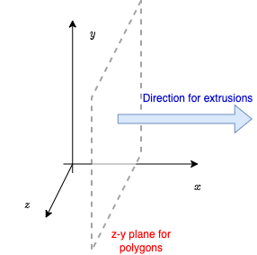
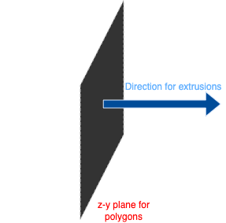

==========================
Create (Fascicle) Geometry
==========================

In NRV, geometries are managed through dedicated classes that allow you to define the shape and structure of fascicles. Custom geometries are currently only used to define fascicles, but this may be extended in the future to nerves and electrodes.

All geometries share a common setup, as described in the figure below:

On the (x, y, z)-frame:

- All extrusions are automatically performed in the direction of the axons, i.e., along the x-axis.
- As a consequence, all 2-D shapes (circles, ellipses, or polygons) are constructed in the z-y plane. By default, x is often assumed to be zero.

.. warning::

    For now, custom geometries are only used to define fascicles. This may be extended in the future to both nerves and electrodes.

Geometry Base Class: CShape
===========================

All geometry classes inherit from the base class :class:`~nrv.utils.geom.CShape`, which defines the required interface for all shapes.

**Principle**

To define a new geometry, you need to implement the following methods:

- :meth:`~nrv.utils.geom.CShape.is_inside` Checks if a given point is inside the C-shape. *Required for axon placement and meshing*
- :meth:`~nrv.utils.geom.CShape.get_point_inside` Returns coordinates of n points randomly picked inside the shape. *Required for axon placement*
- :meth:`~nrv.utils.geom.CShape.get_trace` Returns the trace of the geometry as a list of points. *Required for meshing and plotting*
- :meth:`~nrv.utils.geom.CShape.rotate` Rotates the shape. *Required for fascicle placement*
- :meth:`~nrv.utils.geom.CShape.translate` Translates the shape. *Required for fascicle placement*

And the following properties:

- :meth:`~nrv.utils.geom.CShape.area` Area of the shape in :math:`\mu m^2`. *Required for meshing*
- :meth:`~nrv.utils.geom.CShape.perimeter` Perimeter of the shape in :math:`\mu m`. *Required for meshing*
- :meth:`~nrv.utils.geom.CShape.bbox_size` Size of the bounding box of the shape. *Required for meshing*
- :meth:`~nrv.utils.geom.CShape.bbox` Coordinates of the bounding box as a :class:`numpy.ndarray` in the following format :math:`y_{min}, z_{min}, y_{max}, z_{max}`. *Required for meshing*

**Example:**

Here is a very simple example showing how to create a custom class inheriting from ``CShape``:
    .. code-block:: python3

        from nrv.utils.geom import CShape

        class MyShape(CShape):
            def get_trace(self):
                # Return list of (y, z) points on the shape boundary
                pass

            def is_inside(self, point: tuple, delta: float = 0, for_all: bool = True):
                # Check if the point or list of points is inside the shape
                pass

            def get_point_inside(self, n_pts: int = 1, delta: float = 0):
                # Return an np.ndarray of random points inside the shape
                pass

Builtin Shapes
==============

NRV provides several built-in geometries for fascicles. The following table summarizes the available shapes:

.. list-table:: set_axons_parameters parameters
  :widths: 10 10 50
  :header-rows: 1

  * - Shape Name
    - Class
    - Init arguments

  * - Circle
    - :class:`~nrv.utils.geom.Circle`
    - `center` (:class:`tuple`), `radius` (:class:`float`)

  * - Ellipse
    - :class:`~nrv.utils.geom.Ellipse`
    - `center` (:class:`tuple`), `radius` (:class:`tuple`)

  * - Polygon
    - :class:`~nrv.utils.geom.Polygon`
    - `vertices` (:class:`numpy.ndarray` *of dimension (n_gon, 2)*)

.. seealso::
    :doc:`Example 19 <../examples/generic/19_build_geometry>` --- Implementation of an instance of each shape.

**Example**

Here is a simple example showing how to create a circular geometry:
 - From the class:
    .. code-block:: python

        from nrv.utils.geom import Circle

        # Create a circle with center (0, 0) and radius 50
        circle = Circle(center=(0, 0), radius=50)
        print(circle.is_inside((5, 5)))
        # out: True
        print(circle.is_inside((100, 40)))
        # out: False

 - Using the magic function :func:`~nrv.utils.geom.create_schape`
    .. code-block:: python

        import nrv

        # Create a circle with center (0, 0) and radius 50
        circle = nrv.create_schape(center=(0, 0), radius=50)
        print(circle.is_inside((5, 5)))
        # out: True
        print(circle.is_inside((100, 40)))
        # out: False

Extending Geometries
====================

To define your own custom geometry, subclass ``CShape`` and implement the required methods as shown above.

----

.. note::

    For more details on each geometry class, refer to the API documentation.

.. tip::

    For other examples of geometry, especially those linked with axon populations (see the next section in the user's guide), please have a look at:

    - :doc:`example 21 <../examples/generic/21_place_population>`
    - :doc:`example 23 <../examples/generic/23_subpop_iclamp>`
