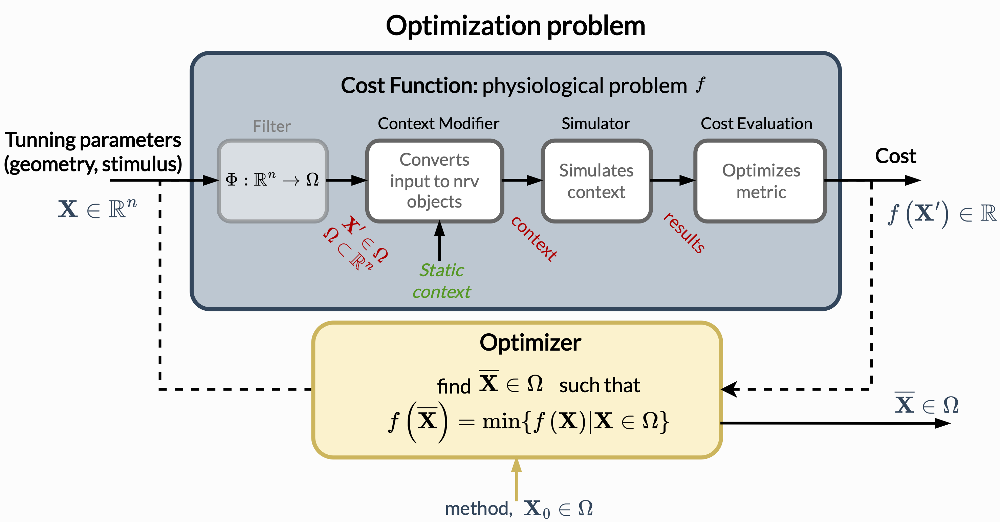

============
Optimization
============
NRV has an integrated optimization layer that allows the impact of input tuning parameters on the outcome of a simulation to be optimized directly.

.. seealso::

    :doc:`tutorials 5</tutorials/5_first_optimization>`: First optimization problem using NRV

Optimization Problem
====================

In NRV, an optimization problem consists of two components, as shown in the figure below: 
 - **An optimizer** : based on algorithms from third party libraries (``scipy`` and ``pyswarms``).
 - **A cost function**: a function from :math:`\mathbb{R}^n` to :math:`\mathbb{R}` that is to be minimized.

In addition, NRV introduces a way to evaluate the impact of specific parameters in simulations and final cost assessment through a `Cost_Function` class consisting of

- A filter: an optional Python ``callable`` object for vector formatting or space restriction.
- A static context: an NRV-:doc:`simulable</usersguide/simulables>` object as an axon, fascicle or nerve, set as the base for the simulation.
- A ``context_modifier`` object: creates an updated local context from the static context and input vector.
- A ``cost_evaluation`` object: evaluates a cost from the simulation results. It's a generic ``callable`` class, allowing user-defined functions.
- A saver: an optional Python ``callable`` object that store specific parameters and results during the optimization

The definition of an optimization problem is handled in NRV by the class :class:`~nrv.optim.Problems.Problem`. An instance of this class consists of a ``cost_fonction`` and an ``optimizer`` which can easily be set as in the example below:

::

    my_prob = nrv.Problem()
    my_prob.costfunction = my_cost
    my_prob.optimizer = my_optimizer

Once set correctly, the optimizer can be started by calling the instance as shown below. The optimization returns an :class:`~nrv.optim.optim_utils.optim_results.optim_results` object containing various information and results of the optimization.

::

    res_optim = my_prob(**kwrgs)

.. note::
    Key arguments can be added to modify some parameters of the ``optimizer``. All keys used for the optimizer instantiation can be reset when the optimizer is called.

.. tip::
    Multicore is fully handled by the classes :class:`~nrv.optim.Problems.Problem` and :class:`~nrv.optim.CostFunctions.cost_function`. Optimization on `nerve` or `fascicles` contexts can this be run with ``mpirun`` command as shown in :doc:`Parallel computation </usersguide/parallel>` users guide.

Cost Function
=============

The first component of the optimization problem is the `cost function` which have to be optimized. As for :class:`~nrv.optim.Problems.Problem`, NRV contains a built-in class, :class:`~nrv.optim.CostFunctions.cost_function`, which offers the possibility to costume a suitable `cost function` for each problem.

As mentioned above, `cost functions` is composed of the tree following components:
 - a `static context`
 - a `context modifier`
 - a `cost evaluation`

These components can be set either by instantiating the :class:`~nrv.optim.CostFunctions.cost_function` class:
::

    my_cost = nrv.cost_function(
    static_context=my_static_context,
    context_modifier=my_context_modifier,
    cost_evaluation=my_cost_evaluation,
    kwargs_S=kwarg_sim
    kwargs_CM=kwarg_cm
    kwargs_CE=kwarg_ce)

or be generated empty and filled later:
::

    my_cost = nrv.cost_function()
    [...]
    my_cost.set_static_context(my_static_context, **kwarg_sim)
    my_cost.set_context_modifier(my_context_modifier, **kwarg_cm)
    my_cost0.set_cost_evaluation(my_cost_evaluation, **kwarg_ce)

.. Warning:: 
    :class:`~nrv.optim.CostFunctions.cost_function` is one of the few classes in NRV which cannot be saved using the ``save`` method, because of the ``cost_evaluation`` component. 
    The option will be added in future version of NRV.

Context Modifier
----------------

`Context modifiers` are callable objects that adapt the static context according to an input vector. They can modify various aspects of the static context, such as stimulus waveform, electrode geometry, etc...

Several `context modifiers` have been implemented in NRV for general use. They all inherit from a generic context modifier class: :class:`~nrv.optim.optim_utils.ContextModifiers.context_modifier`. A list of existing contexts is given below:

.. list-table:: **List of built-in context modifiers**
    :widths: 10 150 10
    :header-rows: 1
    :align: center

    *   - Name
        - Description
        - See Also
    *   - :class:`~nrv.optim.optim_utils.ContextModifiers.stimulus_CM`
        - Generic context modifiers targeting the modification of an electrode stimulus. This modification can either be done by interpolation the input vector or by generating a specific stimulus from this vector.
        - :doc:`o02 </examples/optim/o02_stimulus_CM>` :doc:`T5 </tutorials/5_first_optimization>`
    *   - :class:`~nrv.optim.optim_utils.ContextModifiers.biphasic_stimulus_CM`
        - Context modifier, inheriting from :class:`~nrv.optim.optim_utils.ContextModifiers.stimulus_CM`, which adds use inputs parameters to tune a :meth:`~nrv.fmod.stimulus.stimulus.biphasic_pulse` to an electrode of the static context.
        - :doc:`o03 </examples/optim/o03_biphasic_stimulus_CM>` :doc:`T5 </tutorials/5_first_optimization>`
    *   - :class:`~nrv.optim.optim_utils.ContextModifiers.harmonic_stimulus_CM`
        - Context modifier, inheriting from :class:`~nrv.optim.optim_utils.ContextModifiers.stimulus_CM`, which adds use inputs parameters to tune a :meth:`~nrv.fmod.stimulus.stimulus.harmonic_pulse` to an electrode of the static context.
        - :doc:`o04 </examples/optim/o04_harmonic_stimulus_CM>`

For a fully customize optimization problem, it is also possible to use user-defined `context modifiers`. Such a function should follow the structure bellow:

::

    def homemade_context_modifier(X: np.ndarray, static_context: NRV_simulable, **kwargs) -> NRV_simulable:
        # load the `static_context`
        local_sim = nrv.load_any(static_context, ...) 

        [...]   # script modifying local_sim according X

        # returning modified context
        return local_sim

.. note::
    For  user-defined `context modifier` classes, the method ``__call__`` should have the structure above:

    ::

        def __call__(self, X: np.ndarray, static_context: NRV_simulable, **kwargs)-> NRV_simulable:
        ...

Cost Evaluation
---------------

`Cost evaluation` are callable objects that return a cost evaluated from the results of a simulation. As with `context modifiers`, several `cost evaluation` classes have been implemented in NRV. All of these classes inherit from :class:`~nrv.utils.nrv_function.cost_evaluation` which has two main consequences:
 1. These classes are compatible with algebraic operations.
 2. The ``save`` and ``load`` methods **are not** implemented in these classes.

The list of built-in `cost evaluations` is given in the table below:

.. list-table:: **List of built-in context modifiers**
    :widths: 10 150
    :header-rows: 1
    :align: center

    *   - Name
        - Description
    *   - :class:`~nrv.optim.optim_utils.CostEvaluation.raster_count_CE`
        - Count the number of spike by fiber triggered during the simulation.
    *   - :class:`~nrv.optim.optim_utils.CostEvaluation.recrutement_count_CE`
        - Count the number of fibers activated (or not activated) during the simulation.
    *   - :class:`~nrv.optim.optim_utils.CostEvaluation.charge_quantity_CE`
        - Evaluate a value proportional to the charge injected by an electrode or a list of electrodes.
    *   - :class:`~nrv.optim.optim_utils.CostEvaluation.stim_energy_CE`
        - Evaluate a value proportional to the energy injected by an electrode or a list of electrodes

.. Warning:: 
    Because :class:`~nrv.utils.nrv_function.cost_evaluation` inherits from :class:`~nrv.utils.nrv_function.nrv.function`, an instance of this class cannot be saved using a ``save`` method. This option may be added in the future version of NRV.

As with `context modifiers`, `cost evaluation` can also be user-defined. Such a function should follow the structure below:

::

    def homemade_cost_evaluation(results: sim_results, **kwargs) -> float:

        [...]   # evaluate `sim_results`

        # returning corresponding cost
        return cost

.. note::
    For user-defined `cost evaluation` classes, it may be preferable to inherit the class from :class:`~nrv.utils.nrv_function.cost_evaluation`, to maintain the compatibility with algebraic operations. 
    In this case the above structure should be added to a method named ``call_method``:

    ::

        class homemade_cost_evaluation(nrv.cost_evaluation):
            [...]

            def call_method(results: sim_results, **kwargs) -> float:
            ...

    Otherwise, the method call can be used:

    ::

        def __call__(results: sim_results, **kwargs) -> float:
        ...

Filter (optional)
-----------------

Filters are callable objects which used in the `cost function` to format the input vector before calling the `context modifier`. It can be set at the instantiation of the cost function:

::

    my_cost = nrv.cost_function(
        static_context=my_static_context,
        ...,
        filtes=my_filter
    )

.. Warning:: 
    Use of filter is not recommanded, it might not be supported in future versions. If an input vector formatting is required, this should be added to the context modifiers.

Optimizer
=========

The second component of an optimization problem in NRV is the optimizer. Two optimizer classes, based on various algorithms, are implemented in NRV. These two classes both inherit from :class:`~nrv.optim.Optimizers.Optimizer` and can be used to minimize a function by calling the ``minimize`` or simply by calling the optimizer.

.. note::
    As mentioned above:

    ::

        res = my_optimizer.minimize(func_to_minimize, ...)
        
    is equivalent to:

    ::

        res = my_optimizer(func_to_minimize, ...)

The two optimizer classes available in NRV are listed below: 

.. list-table:: **List of optimizers in NRV**
    :widths: 10 150
    :header-rows: 1
    :align: center

    *   - Name
        - Description
    *   - :class:`~nrv.optim.Optimizers.scipy_optimizer`
        - Class insuring the compatibility between `scipy.optimize.minimize <https://docs.scipy.org/doc/scipy/reference/generated/scipy.optimize.minimize.html#scipy.optimize.minimize>`_ optimization algorithms and NRV optimization problems.
    *   - :class:`~nrv.optim.Optimizers.PSO_optimizer`
        -   Class providing particle swarm optimization based on `Pyswarms <https://pyswarms.readthedocs.io/en/latest/>`_ algorithms, adapted to NRV optimization problems.

.. tip::
    In general, the choice of optimization classes depends on the problem characteristics:

        - :class:`~nrv.optim.Optimizers.scipy_optimizer` is more suitable for **continuous problems**
        - :class:`~nrv.optim.Optimizers.PSO_optimizer` is preferable for **discontinuous problems** 

.. warning::
    `Pyswarms <https://pyswarms.readthedocs.io/en/latest/>`_ algorithms may be replaced by `scikit-opt <https://scikit-opt.github.io/scikit-opt/#/en/>` in future versions.
