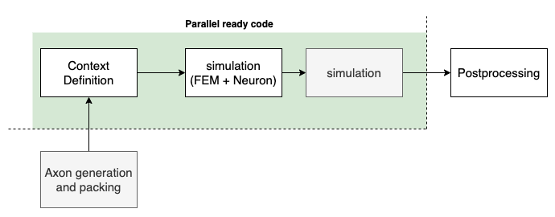
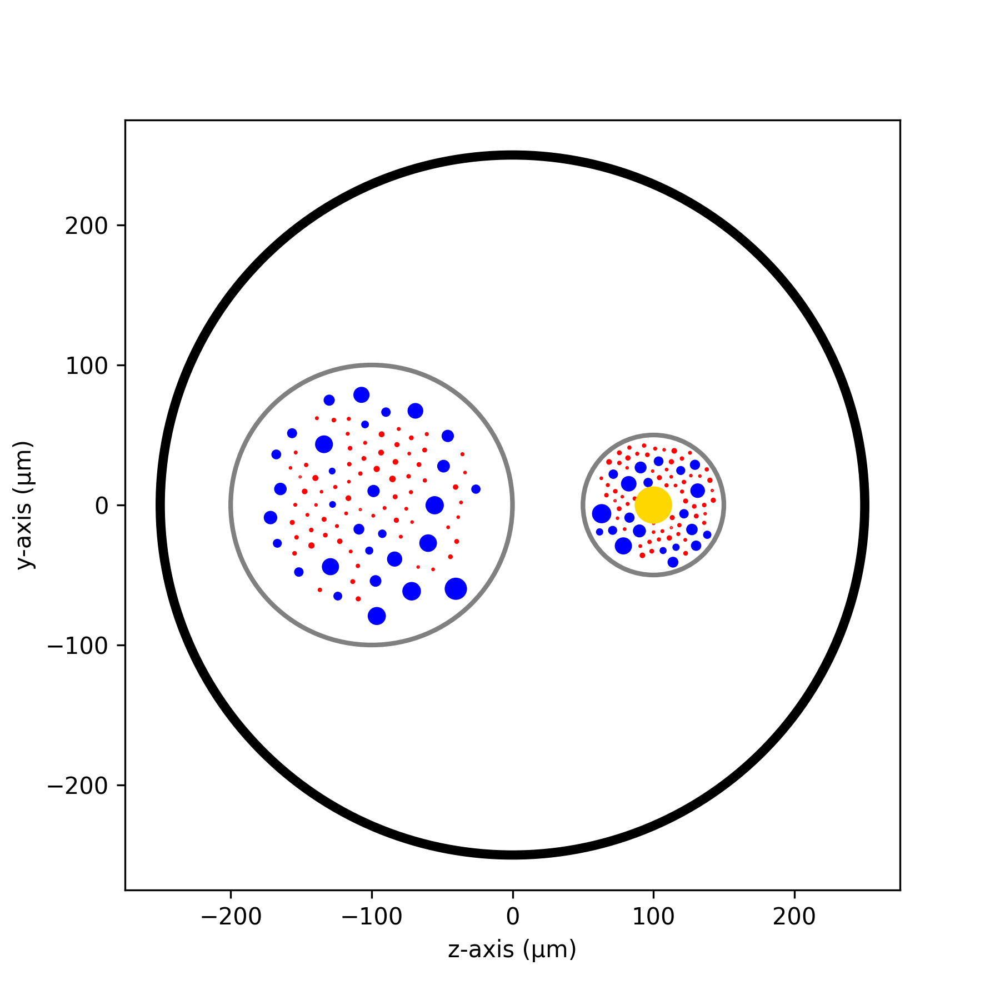
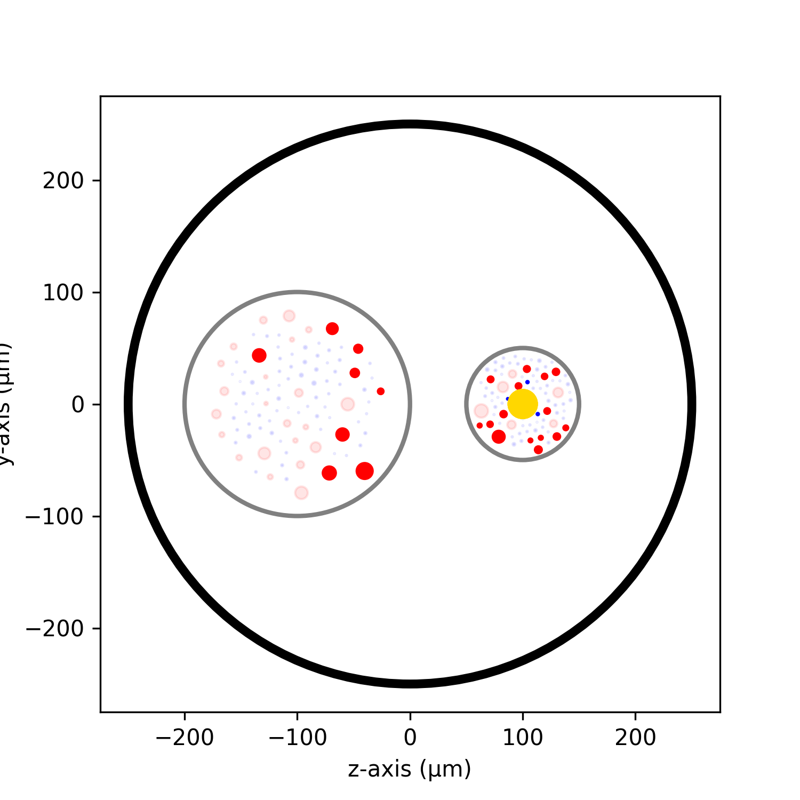

====================
Parallel computation
====================

Rapid explanation
=================

NRV has been designed to enable parallel computing without changing the description of simulated problems. In the case of axon fibers simulation, if ephaptic coupling is neglected (interactions between fibers), the problem is called *embarrassingly parallel*, meaning that the behavior of individual fibers can be computed on different cores without inducing a need for communications between cores.

However, the computational load distribution is a bit more complex:

- FEM computations are not included in the former remark,

- For post-processing, the results of different axon simulations in a fascicle/nerve simulation are gathered, meaning a basic synchronicity between simulations.

- Axon population generation and packing are based on specific algorithms.

NRV aims at providing solutions for the end user, where the scalability of the simulation, from a few cells to large nerves does not imply user knowledge and considerations on these points are handled internally.

At this time of development, the following figure indicates what part of the process are fully parallelized:

One have to note that the generation and packing of population is for the moment only on one core. Post-processing is usually performed on a limited number of cores, or at least separated from computations when performing large computation, we do not want to change this habit. However, in future versions, we plan to parallelize these task to limit execution time.

Before version 1.2, the multi-core splitting was handled using the Message Passing Interface (MPI). This is not the case anymore since version 1.2, where only the python standard API is used to handle parallelization. This means that NRV can be used on any computer, from a laptop to a cluster, without requiring any specific installation.

A huge effort has been made to ensure that axon generation and packing is fast and efficient, and that the user does not have to worry about the time spent by these steps even on populations around 1,000 axons or more on one core. The CPU dispatch of simulation is now fully invisible for the user, who can still specify the number of CPU for main computational steps in the ``NRV.ini`` file. The user can also specify the number of CPU used for each step in python file.

Parallel processing: how to control execution
=============================================

The parallelization is almost transparent for the end user. Here we provide a simple example to illustrate where things can be parallelized, and give few additional information.

Illustrative example
--------------------

In order to illustrate how large computation can be handled, we provide an example of a nerve simulation. The script is divided in three functions. The first few lines here below load the libraries and define the nerve geometry definition:

.. code:: ipython3

    import nrv
    import matplotlib.pyplot as plt
    
    def create_nerve():
        ## parameters
        # nerve parameters
        outer_d = 5         # in mm
        nerve_d = 500       # in um
        nerve_l = 5000      # in um
        # first fascicle
        fasc1_d = 200       # in um
        fasc1_y = -100      # in um
        fasc1_z = 0         # in um
        # second fascicle
        fasc2_d = 100       # in um
        fasc2_y = 100       # in um
        fasc2_z = 0         # in um
        # stimulus
        t_start = 0.1       #start of the pulse, in ms
        t_pulse = 0.1       #duration of the pulse, in ms
        amp_pulse = 60      #amplitude of the pulse, in uA 
        # create objects
        nerve = nrv.nerve(length=nerve_l, diameter=nerve_d, Outer_D=outer_d)
        fascicle_1 = nrv.fascicle(diameter=fasc1_d, ID=1)
        fascicle_2 = nrv.fascicle(diameter=fasc2_d, ID=2)
        nerve.add_fascicle(fascicle=fascicle_1, y=fasc1_y, z=fasc1_z)
        nerve.add_fascicle(fascicle=fascicle_2, y=fasc2_y, z=fasc2_z)
        # create axon population
        n_ax = 100      #size of the axon population
        axons_diameters, axons_type, M_diam_list, U_diam_list = nrv.create_axon_population(n_ax, percent_unmyel=0.7, M_stat="Ochoa_M", U_stat="Ochoa_U",)
        fascicle_1.fill_with_population(axons_diameters, axons_type, delta=5)
        axons_diameters, axons_type, M_diam_list, U_diam_list = nrv.create_axon_population(n_ax, percent_unmyel=0.7, M_stat="Ochoa_M", U_stat="Ochoa_U",)
        fascicle_2.fill_with_population(axons_diameters, axons_type, delta=5)
        fascicle_1.fit_population_to_size(delta=2)
        ## add electrode and stimulation
        # electrode
        extra_stim = nrv.FEM_stimulation(endo_mat="endoneurium_ranck",peri_mat="perineurium", epi_mat="epineurium", ext_mat="saline")
        life_d = 25                                 # LIFE diamter in um
        life_length = 1000                          # LIFE active-site length in um
        life_x_offset = (nerve_l-life_length)/2     # x position of the LIFE (centered)
        life_y_c_2 = fasc2_y                        # LIFE_2 y-coordinate (in um)
        life_z_c_2 = fasc2_z                        # LIFE_1 z-coordinate (in um)
        elec_2 = nrv.LIFE_electrode("LIFE_2", life_d, life_length, life_x_offset, life_y_c_2, life_z_c_2) # LIFE in the fascicle 2
        # stimulus
        pulse_stim = nrv.stimulus()
        pulse_stim.pulse(t_start, -amp_pulse, t_pulse)      #cathodic
        #Attach electrodes to the extra_stim object 
        extra_stim.add_electrode(elec_2, pulse_stim)
        nerve.attach_extracellular_stimulation(extra_stim)
        fig, ax = plt.subplots(1, 1, figsize=(6,6))
        nerve.plot(ax)
        ax.set_xlabel("z-axis (µm)")
        ax.set_ylabel("y-axis (µm)")
        fig.savefig("nerve_example.png", dpi=300)
        plt.close(fig)
        return nerve

The function basically returns a nerve, which is a simulable-object. This function, if called should basically provide a plot like:

The next function performs the simulation and enables the end user to directly provide the number of CPU available for the computation. 

.. code:: ipython3

    def simulate_nerve(nerve, nproc=12):
        nrv.parameters.set_nmod_ncore(nproc)
        results = nerve(t_sim=3,postproc_script = "is_recruited")
        return results

The results are then processed to highlight only fibers that trigger an action potential:

.. code:: ipython3

    def prostprocessing(results):
        fig, ax = plt.subplots(1, 1, figsize=(5,5))
        results.plot_recruited_fibers(ax)
        ax.set_xlabel("z-axis (µm)")
        ax.set_ylabel("y-axis (µm)")
        fig.savefig("nerve_postproc.png", dpi=300)
        plt.close(fig)

Performing this small simulation pipeline results in a main program of the form to compute for instance on 12 CPUs:

.. code:: iphython3

    if __name__ == "__main__":
        #################
        # PREPROCESSING #
        #################
        # This is not compultationally intensive,
        # so we can use only on processes
        sim_nerve = create_nerve()

        ##############
        # SIMULATION #
        ##############
        # This is computationally intensive,
        # so we can use multiple processes
        results = simulate_nerve(sim_nerve, nproc=12)

        ##################
        # POSTPROCESSING #
        ##################
        # This is not compultationally intensive,
        # so we can use only on processes
        prostprocessing(results)

The post-pocessing step should provide a plot like:

As mentioned in the comments, and as a consequence of explanations with the figure that explains what steps are parallel, only the simulation is automatically split on CPU. All memory access, results gathering and computational step sequences are automatically handled behind the scene.

.. note::
    If the specified number of CPU is higher than available on the computational machine, threads will coexist on some CPU. The computation will be performed without consequence on the results, but the overall timing won't be optimum.

.. note::
    It is important here to notice that a good practice for effective code is to place in a python ``__main__``.

.. note::
    The user can encounter some issues (computational time not optimized mainly), when using jupyter notebooks for massively parallel computation. We, developers, are aware of such possible problems and work on this point. Basically, massively parallel computation should be launched from scripts, nerve design and post-processing can be performed without any trouble and is convenient on notebooks.

More details on tuning CPUs behind the scene
--------------------------------------------

when not specified in the python file or script, the number of cores used for axon fibers parallelization is defined in the file ``nrv/_misc/NRV.ini``. In this file, the number of cores for each computational step can be specified:

.. list-table:: specifying the number of cores in the ini file
    :widths: 50 150
    :header-rows: 1
    :align: center

    *   - KEY
        - meaning and comment
    *   - FASCICLE_CPU
        - number of CPU used to distribute calls to NEURON
    *   - COMSOL_CPU
        - number of CPU used for comsol computations, Warning: this should correspond to the commercial licence you are using.
    *   - GMSH_CPU
        - number of CPU used for meshing with GMSH, we recommend with the current version of GMSH not to exceed 4 to get consistent results and limit meshing time.
    *   - FENICS_CPU
        - number of CPU used for FEM computation with FenicsX. For the moment, we recommend to keep 1, however computation with more CPU is possible. We still work on adapting the pre-conditioner and solver to the number of CPU to ensure consistent results.

Note that except the number of CPU used for calls to NEURON, these keys directly control the behavior of NRV for FEM and meshing, whatever the number of CPU given to MPI. This ensures optimal usage of third party libraries, and is automatically handled by NRV.

What about GPUs ?
-----------------

GPUs becomes more and more popular to handle massive computational load. Neuron has possibilities to handle GPUs, but for interconnected network, which makes it useless for populations of independant axons. There have been some discussions in the Fenics Project about computation on GPUs, but nothing magic yet. For the moment, NRV does not perform any computation on GPUs.

We are aware that some libraries such as CuPy or PyTorch can be used to perform some computations on arrays, and we hope to evaluate the possible computational gain of using these tools for future versions.