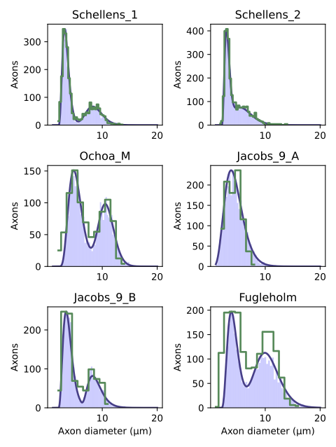

==========================
Generate axons populations
==========================

Simulable objects are either single axons, fascicles and nerve. The last two contain one more many axons. To create new populations of axons, NRV comes with two functionalities described below:

- Tools for automated generation of populations with controlled diameters, based on experimental observations.

- A packing algorithm that shuffles the generated population on the spacial grid, and that shuffles nodes of Ranvier for myelinated fibers.

.. tip::
    It is also possible to use already created and placed populations of fibers as shown bellow.

Population generation
=====================

Axon population
---------------

Populations of axons are stored in the framework under the path ``nrv/_misc/pops`` as ``.pop`` files. These files follow a CSV-like structure with the following columns:

.. list-table:: 
   :header-rows: 1

   * - Fiber diameter
     - Fiber type
     - Not a Number
     - Not a Number
   * - (in µm)
     - (1.0 for myelinated / 0.0 for unmyelinated)
     - (`NaN`)
     - (`NaN`)

.. note::
    The last two columns are placeholders used to maintain compatibility with placed populations (see below) and to ensure consistent data formatting in the code.

Six predefined unplaced populations are available, corresponding to different total numbers of axons: 100, 200, 500, 1000, 2000, and 5000.

Axon placed population
----------------------

Placed populations of axons are stored under the path ``nrv/_misc/pops`` in ``.pop`` files. These files are similar to CSV files and contain the following columns:

.. list-table:: 
   :header-rows: 1

   * - Fiber diameter
     - Fiber type
     - y-axis coordinate
     - z-axis coordinate
   * - (in µm)
     - (1.0 for myelinated / 0.0 for unmyelinated)
     - (in µm)
     - (in µm)

Six predefined placed populations are available, corresponding to different total numbers of axons: 100, 200, 500, 1000, 2000, and 5000.

Diameter distributions
======================

Create ex-novo population
-------------------------

To create a new population of fibers from scratch, you can use the function :meth:`~nrv.nmod.create_axon_population`. This function returns four lists:

- A list of axon diameters (in :math:`\mu m`).
- A list indicating axon types, where ``1.0`` corresponds to myelinated fibers and ``0.0`` to unmyelinated fibers.
- A list of diameters for the subgroup of myelinated fibers.
- A list of diameters for the subgroup of unmyelinated fibers.

The arguments for the function are:

- ``N`` (``int``): Number of axons to generate in the population (both myelinated and unmyelinated).
- ``percent_unmyel`` (``float``): Ratio of unmyelinated axons in the population. Must be between 0 and 1.
- ``M_stat`` (``str``): Name of the statistical distribution in the library, or a path to a custom CSV file containing myelinated fiber diameter statistics.
- ``U_stat`` (``str``): Name of the statistical distribution in the library, or a path to a custom CSV file containing unmyelinated fiber diameter statistics.

There are predefined statistical distributions available for unmyelinated fibers, derived from literature. These distributions are interpolated and used as random generators for axon diameters.

.. list-table:: pre-defined statistics for unmyelinated fibers
    :widths: 50 150
    :header-rows: 1
    :align: center

    *   - Name
        - scientific source and comment
    *   - "Ochoa_U"
        - From human normal sural nerve, scientific reference [stat1]
    *   - "Jacobs_11_A"
        - From human normal sural nerve, scientific reference [stat2]
    *   - "Jacobs_11_B"
        - From human normal sural nerve, scientific reference [stat2]
    *   - "Jacobs_11_C"
        - From human normal sural nerve, scientific reference [stat2]
    *   - "Jacobs_11_D"
        - From human normal sural nerve, scientific reference [stat2]

These statistics (grey curves), and their interpolations in NRV (red curves) and an example of generated population histogramm are depicted in the figure bellow:

.. image:: ../images/distributions_unmyelinated.png

as well as for myelinated fibers:

.. list-table:: pre-defined statistics for myelinated fibers
    :widths: 50 150
    :header-rows: 1
    :align: center

    *   - Name
        - scientific source and comment
    *   - "Schellens_1"
        - From human normal sural nerve, scientific reference [stat3]
    *   - "Schellens_2"
        - From human normal sural nerve, scientific reference [stat3]
    *   - "Ochoa_M"
        - Statistics from human normal sural nerve, scientific reference [stat1]
    *   - "Jacobs_9_A"
        - From human normal sural nerve, scientific reference [stat2]
    *   - "Jacobs_9_B"
        - From human normal sural nerve, scientific reference [stat2]

These statistics (grey curves), and their interpolations in NRV (blue curves) and an example of generated population histogramm are depicted in the figure bellow:

The script use to plot those histograms is made available in the :doc:`examples list<../examples/generic/13_axon_distributions>`

The scientific references used are:

- [stat1] Ochoa, J., & Mair, W. G. P. (1969). The normal sural nerve in man: I. Ultrastructure and numbers of fibres and cells. Acta neuropathologica, 13, 197-216.

- [stat2] Jacobs, J. M., & Love, S. (1985). Qualitative and quantitative morphology of human sural nerve at different ages. Brain, 108(4), 897-924.

- [stat3] Schellens, R. L., van Veen, B. K., Gabreëls‐Festen, A. A., Notermans, S. L., van't Hof, M. A., & Stegeman, D. F. (1993). A statistical approach to fiber diameter distribution in human sural nerve. Muscle & Nerve: Official Journal of the American Association of Electrodiagnostic Medicine, 16(12), 1342-1350.

Describe a new statistical law
------------------------------

Predefined statistics are simple csv files with two columns:

1. Starting value of the bin for diameter histogram.

2. Value of the probability for the corresponding bin

The length of the bins is automatically determined by two successive values. Note last bin is the same size as previous one. Sum of probabilities is automatically normalized to 1.

Users can find the predefined statistics at the path ``nrv/_misc/stats/``. Adding files to this folder make the statistics accessible by the filname without the extension. It is also possible to specify the statistics with a string beeing the path to the specific file.

Axon Packing
============

Once generated, the population can be packed, i.e. fibers are automatically placed on the y-z plane with a given proximity and with no overlap. Starting on a grid, axons are automatically migrated in the direction of a so-called gravity center during a number of iterations. At each step, a velocity for each axon is computed, considering the attraction to the gravity center and the collisions that can occur between cells with a minimal distance to respect between fibers. The animation below is an example of population packing.

.. image:: ../images/packing_anim.gif

The packing is performed with a single function called :meth:`~nrv.nmod.axon_packer`, and the function is designed to interface with the :meth:`~nrv.nmod.create_axon_population` function detailed previously. 

Interacting with populations
============================

It is also possible to plot the population on a ``matplotlib`` figure using the function :meth:`~nrv.nmod.plot_population`.

Saving a placed population to a ``.ppop`` file can be done with the function :meth:`~nrv.nmod.save_axon_population`, which accepts the following parameters:

Loading a ``.ppop`` file can be done using the function :meth:`~nrv.nmod.load_axon_population`.

An example demonstrating the proper use of the packer and plotting/saving tools is provided in **example XXX**

.. seealso::

   **TODO EXAMPLE**

.. warning::

   In a future release of the code, we plan to create an ``axon_population`` class that will encapsulate all these methods. This class will provide a more convenient way to manipulate populations and sub-populations of axons through logical and arithmetic operations, filtering, and more.

